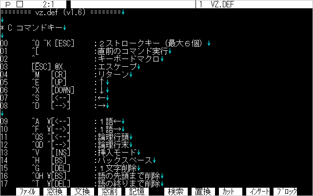

# 第１章 インストール

## １.１ ディスクへの組み込み

&emsp;VZエディタには、3枚のマスターディスクが付属しています。それぞれのディスクにには、次のような機種版が入っています。

●98フォーマット（1.25MB）5インチ／3.5インチ 
&emsp;　　　PC-9800シリーズ、EPSON PCシリーズ版 
&emsp;　　　J-3100版 

●IBMフォーマット（1.44MB）3.5インチ 
&emsp;　　　DOS／V PC版、AX版、PS／55版、IBM（英語モード）版 

&emsp;フロッピーディスクのラベルを確認し、動作マシンに応じていずれかのマスターディスクをパソコンにセットしてください。

★ **マスターディスクは書き込み禁止にしてセットしてください。**

&emsp;お使いにマシンによって、ドライブ名が異なりますので、ドライブAのフロッピーディスクから、ドライブCのハードディスク（またはフロッピーディスク）へ組み込む場合で説明します。

**【インストールの手順】** 

1.マスターディスクをセットしたドライブを、カレントドライブとしてください。

	C:¥>a:⏎
	A:¥>

2.installプログラムを実行します。「install」の後にスペースに続いてコピー先のドライブ名を入力します。

	A:¥>install c:

&emsp;　この場合、VZエディタはサブディレクトリ「C:¥VZ」へコピーされます。それ以外のディレクトリへコピーしたい場合は、さらにスペースに続いてサブディレクトリ名を入力します。

	A:¥>install c: ¥tool¥vz

&emsp;　ここで⏎を打ってください。

	A:¥>install c:⏎

	VZ Editor Ver1.6 をドライブ c:¥VZ にインストールします.
	準備ができたらキーをどれか押してください...

&emsp;いずれかのキーを押すと、コピーが始まります。インストールを中断したい場合は、[**Ctrl**]+[**C**]を押してください。

&emsp;ファイルのコピーが終了すると、次のメッセージを表示します。

	VZ Editor のインストールは完了しました.
	VZ [ﾘﾀｰﾝ]で起動します.
	C:¥>

&emsp;これでインストールは完了です。「vz⏎」と入力してください。

	C:¥VZ>vz

タイトルメッセージが表示され、上のウィンドウを開けばOKです。

● タイトルメッセージも何も表示せずに、即座にこのウインドウが表示され時は、すでに古い版のVZが常駐しています。もし、古い版と同じディレクトリへインストールしていしまった場合は、パソコンをリセットしてください。今度は新しいVZが常駐します。そうでない場合は、いったん古い版のあるディレクトリへ移動し、常駐を解除してください。 

	Illegual mode!

&emsp;というメッセージを表示して、DOSプロンプトへ戻ってしまった場合は、次の原因が考えられます。 　1.IBM版で、対応していない画面モードになっている
&emsp;2.機種判定が正常に行われず、間違った機種版をインストールしている

マニュアルの各機種版の章をお読みください。それでも原因がわからない場合は、サポートへご連絡ください。

## １.２ PATHと環境変数の設定

&emsp;インストールが完了したら、次はPATHと環境変数の設定です。

### ■ PATH
&emsp;VZをインストールしたディレクトリを、PATHに登録しておきましょう。PATHの設定は、VZで「AUTOEXEC.BAT」ファイルを書き換えます。

&emsp;まずVZを起動します。ウィンドウが開いたら、[↑]キーを2回押してください。ウィンドウに「¥autoexec.bat」という文字列が出て来たら、⏎を押してください。

	C:¥VZ>vz

お使いの「AUTOEXEC.BAT」ファイルを読み込みました。

●**VZをコピーしたドライブが起動ドライブでない場合は、「C:¥AUTOEXEC.BAT」のように、ドライブ名を付けてください。** 

&emsp;「¥AUTOEXEC.BAT」を読み込んだら、ファイルの中で「PATH ..」という記述を探してください。そこに、VZをインストールしたディレクトリを追加します。

	PATH C:¥DOS;C:¥WINDOWS;c:¥vz

変更したら、[**F1**]キーを押して『ファイルメニュー』を表示し、『C ファイルのクローズ』を選択します。すると、

	修正テキストを出力しますか？ (Y/N) 

と聞いてきますので、[**Y**]または⏎を押して出力してください。これでPATHの設定は完了です。

&emsp;次に、環境変数を設定します。VZは「VZDEF，VZPATH，VZBAK，VZLOG，TMP」の5つの環境変数を参照します。しかし、設定しなければVZが使えない、というものではありません。では、それぞれの環境変数について説明しましょう。

### ■ VZDEF
&emsp;環境変数「VZDEF」は、VZが起動時に読み込むDEFファイルのファイル名、またはディレクトリを指定します。次節で詳しく説明します。

［例］

	set vzdef=c:¥vz¥def¥

### ■ VZPATH
&emsp;環境変数「VZPATH」は、ファイル指定時にディレクトリを省略した場合の「文書ファイル検索パス」を指定します。「3.1 ファイル名の書式」で説明します。

［例］

	set vzpath=c:¥vz c:¥txt c:¥doc d:¥nif d:¥mix

### ■ VZBAK
&emsp;モードメニューの「B バックアップ」をオンにすると、ファイルセーブ時に、元のファイルを「.BAK」にリネームして保存します。環境変数「VZBAK」を設定すると、「.BAK」にリネームする代わりに、指定ディレクトリへ古いファイルを移動します。「3.6 バックアップとオートセーブ」で説明します。

［例］

	set vzbak=¥trash	★ ドライブ名を付けてはいけません！

### ■ VZLOG
&emsp;Ver1.6で追加された環境変数です。パソコン通信等でダウンロードしたログファイルの格納ディレクトリを指定します。「3.4 ログファイルの管理」で説明します。

［例］

	set vzlog=c:¥net¥log d:¥

### ■ TMP
&emsp;EMSまたはXMSメモリが十分ない場合は、「テンポラリファイル」や「スワップファイル」をディスクに書き出します。この出力先を指定するのが、環境変数「TMP」です。ラムディスク等を使っていれば、そのドライブを指定してください。

［例］

	set　tmp=i:¥

「TMP」が設定されていない場合は、VZ起動時（常駐時）のカレントディレクトリへ出力します。

● **「VZPATH VZBAK VZLOG」の3つの環境変数は、ファイルをアクセスする時に参照されます。したがって、VZを常駐している場合、コマンドラインから「set」コマンドで再設定することができます。しかし、「VZDEF TMP」の2つは、起動時（常駐時）にしか参照されません。** 

## １.３ DEFファイル

&emsp;VZは、起動時に「コマンド名.DEF」という名前のファイルを読み込みます。これは「DEFファイル」と呼ばれるテキストファイルで、キーアサイン、オプション、マクロ等、ユーザーが変更可能なあらゆる情報が記述されている、「定義ファイル」です。

&emsp;DEFファイルは、起動するVZと同じディレクトリから読み込みます。DEFファイルのみを別のディレクトリに集めておきたい場合は、環境変数「VZDEF」でそのディレクトリを指定しておきます。

	set vzdef=c:¥vz¥def¥		★ 末尾に「¥」を付ける

&emsp;次のように、スラッシュ「/」に続いて読み込むDEFファイルを指定する事もできます。

	vz　/mi

&emsp;この場合は、「VZ.DEF」の代わりに「MI.DEF」を読み込みます。常に「MI.DEF」を読み込みたい場合は、環境変数「VZDEF」で設定できます。

	set vzdef=mi
	set vzdef=c:¥vz¥mi		★ .DEFは省略可能

&emsp;DEFファイルには、起動時読み込む定義ファイルの他に、「マクロファイル」もあります。マクロファイルは、マクロを起動した時に自動的に読み込むか、メニューから実行します。また、起動時にあらかじめ読み込むこともできます。これを「インクルード」と呼びます。

	vz　+tool

&emsp;マクロファイルのインクルードは、「/」ではなく「+」で指定します。「/」と「+」を併用することもできます。

	vz　/mi+tool+game

&emsp;いつもインクルードするマクロファイルは、「VZ.DEF」ファイルに記述しておく事ができます。「VZ.DEF」を読み込み、[**Ctrl**]+[**Q**][**C**]でファイルの最後へジャンプしてください。

	C:¥VZ>vz vz⏎

数字や記号がいろいろ書かれています。[↑]で何行かスクロールすると、次のような記述が見つかります。

	* E その他

	1 vzfl

ここに、インクルードするマクロファイルを書いておくわけです。

&emsp;DEFファイルの内容については、「第7章 カスタマイズ」で詳しく説明いたします。

#### ★ 現在お使いのVZ.DEFからの移行

&emsp;現在お使いのDEFファイルは、Ver1.6の拡張機能を使わないのであれば、そのまま使うことができます。 　Ver1.6の拡張機能を使う場合は、次のように「VZ16.DEF」と「VZFL.DEF」の2つのDEFファイルを、お使いの「VZ.DEF」にインクルードしてください。

	* E その他
	1 vz16+vzfl

&emsp;すでに他のファイルをインクルードしている場合は、それらの前に2つのDEFファイルを記述してください。 　DEFファイルの変更点の詳細については、「VZ16.DOC」をお読みください。

## １.４ 起動時オプション

&emsp;VZは、100を越える起動時オプションをもっています。これは、VZ.DEFの中で指定しています。一度VZ.DEFをオープンして、「* O オプション」の部分を覗いてみましょう。

&emsp;大半のオプションは、英字2字です。大文字、小文字は識別しません。

&emsp;一時的にオプションを設定したい場合は、コマンドラインの起動時オプションとして指定できます。

	vz -dl -dn readme -we40

&emsp;オプションは、ファイル名の前後のどの位置にも書けます（Ver1.6の新機能）。ただし、編集ファイルごとに設定可能ないくつかのオプションは、設定するファイル名の直後に記述しなくてはなりません。

●**コマンドラインで指定したオプションは、DEFファイルの記述よりも優先されます。** 

**【オプションの書式】** 

	-<オプション名>[+|-|n]
|表記|説明|
|---|---|
|<オプション名>|英字1字または2字（大文字、小文字は無視）|
|+ または無指定|スイッチON（値＝1）|
|-|スイッチOFF（値＝0）|
|n|値＝n （10進数）|

●**コマンドラインで指定した場合は、「+」指定は省略可能です。** 

&emsp;オプションのうちよく使うものは、[**Shift**]+[**F1**]の『モードメニュー』で変更できます。さらに、オプションの値を直接参照・変更するコマンドも用意されています。

■ オプションの参照・変更 
&emsp;　　　[**ESC**][@]　[**GPRH**]+[@]　　:マクロ文の実行 

&emsp;[**ESC**][@]を実行すると、次のような小さなウィンドウが現れます。ここで、オプション名を入力してみましょう。（「-」をつけてはいけません）

画面の下に、

	Result: 7 7 $7 ...

のように、現在の値が表示されます。「an6⏎」のように値を入力すれば、オプションを変更することもできます。もちろん、すべてのオプションが編集中に変更できるわけではありません。

## １.５ EMS／XMSの活用

&emsp;386／486マシンの普及、および日本語FEPの必要性から、EMSはほとんどのマシンで利用できるようになりました。さらに、Windowsを利用するために、10MBを越えるメモリを搭載する場合も少なくありません。

&emsp;このような大容量メモリ時代に対応するため、Ver1.6では、拡張メモリの対応を以下のように強化しました。

1. XMSに対応
2. EMS，XMS，TMPを16KBのページ単位で管理し、合計16MBまで利用可能
3. DOSコマンド実行時に、未使用のEMS，XMSメモリを解放

このため、VZとWindowsで、メモリの割り当て量を悩む必要はありません。

&emsp;初期設定では、EMSメモリを全て利用し、XMSは使いません。EMSとXMSの使用量は、次のオプションで設定します。

	EM		EMSの使用ページ数
	XM0		XMSの使用サイズ（KB）

&emsp;XMSを使う場合は、次のように起動します。

	C:¥VZ>vz -xm⏎

&emsp;VZは、EMSとXMSメモリを次の用途で使います。

||EMS|XMS|関連ｵﾌﾟｼｮﾝ|
|---|---|---|---|
|画面保存＋ディレクトリ|2～4|×|FW|
|コンソールバッファ|0～2|×|Bo|
|テンポラリファイル|○|◎||
|スワップファイル|○|◎|SW|

- XMSを使う場合でも、EMSは、最低6ページは確保してください。
- メモリに常駐する場合は、さらにEMS8ページ（XMSの場合は128KB）を確保してください。
- テンポラリファイルとスワップファイルは、XMSの方が優先的に利用されます。
- Ver1.6の98版は、EMSの代わりに裏グラフィックVRAMをワークに使うことはできません。オプション***GV***は無効です。

&emsp;XMSが利用可能かどうかは、「VMAP.COM」を実行してみればわかります。

	----- EMS ver4.0 (frame: C000h) -----       ----- XMS ver3.00 -----
	handle pages   size  name                   HMA used: 62 KB by DOS
	------ ----- ------  --------             ［EMB free: 4364 KB］

&emsp;このように、「EMB free」の表示が出れば、XMSが使えます。

&emsp;さて、EMSとXMSの割り当てはどうしたらよいでしょうか。結論から言えば、XMSを使うメリットは、それほどありません。逆に、EMM386.EXE 以外の市販のメモリドライバでは、XMS関連のファンクションに不具合があるものがあります。このために、安全性を考慮して初期設定ではXMSを使いません。この点に関しては README.DOC をお読みください。

## １.６ 常駐

&emsp;「常駐ソフト」と呼ばれるコマンドがあります。MS-DOS5.0付属の「DOSKEY.COM」がそうですね。常駐ソフトは、起動するとメッセージを表示してすぐにDOSへ戻ります。この時からメモリの一部に「常駐」して、裏でいろいろな仕事をするわけです。必要がなくなったら、常駐ソフトをもう一度起動して、メモリから外します。この外す時は「-r」などのオプションを付ける場合が多いようです。

&emsp;VZも、メモリに常駐する事ができます。次のように「-z」をつけて実行してください。

	C:¥VZ>vz -z⏎
	VZ Editor Version 1.6 Copyright (C) 1989-93 by c.mos
	EMSを最大 105ページ使用します.
	XMSを最大  6912KB使用します.
	メモリに常駐しました.(-zで解放)

	C:¥VZ>

&emsp;メモリに常駐すると、その分フリーエリアが小さくなります。そうなると、大きなプログラムを実行できなくなる場合があります。VZはどのくらいメモリを消費しているでしょうか。これを知るコマンドが、付属の「VMAP.COM」です。

	C:¥VZ>vmap⏎
	VMAP Version 2.01  Copyright (C) 1989-91 by c.mos

	addr PSP  blks   size  owner/parameters           hooked vectors
	---- ---- ---- ------  -------------------------  ------------------
	058C sys    1    2144  himem                      DC
	0613 sys    1    7488  emm386                     1F 4B 67
	07E8 sys    1     112  setver
	07F0 sys    1    4128  kkcfunc
	08F3 sys    4   12992  <config>
	0C23 <--    3    3728  command                    22 23 24 2E
	0D0F        1     336  <free>
	0D25 <--    1    1872  ezkey -f6 -@2 -n- -k3      E0
	0D9B 0009   1   45792  adddrv CON     
	18CA <--    1    1024  30sys111
	190B <--    1   20512  vt                         09 0A 0C 18 28 E2
	1E0E <--    1    1536  vwx 1.03  -z2 -x1 -v       2F
	1E6F <--    1    3808  vz 1.59g -z @@             06 21 29
	1F5E-A000   1  526880  <free>

	----- EMS ver4.0 (frame: C000h) -----       ----- XMS ver3.00 -----
	handle pages   size  name                   HMA used: 62 KB by DOS
	------ ----- ------  --------               EMB free: 6812 KB
	     1     8   128k  WX2K    
	     2     2    32k  WX2     
	     3     1    16k  WX2TX   
	     4     1    16k  WX2TM   
	     5    10   160k  VC Term
	     6     1    16k  for Vwx!
	     7     6    96k  VZ
	  free    99  1584k
	 total   128  2048k

	C:¥VZ>

&emsp;バージョンによって多少異なりますが、約4KB弱のメモリを使います。

&emsp;VZを常駐させると、MS-DOSのコマンドラインでも、カーソルキー等の編集キーが使えます。また、[**ESC**]を押すとただちにVZの『入力ファイル』ウィンドウが開きます。「vz⏎」を実行しても同様です。VZはぜひ「AUTOEXEC.BAT」で常駐して使いましょう。

&emsp;常駐を解除する時は、もういちど「vz -z⏎」を実行します。

	C:¥VZ>vz -z⏎
	VZ Editor Version 1.6 Copyright (C) 1989-93 by c.mos
	メモリを解放しました.

	C:¥VZ>

VMAPを実行して、メモリからなくなっている事を確認してください。

- EMSメモリがないと、常駐サイズは約180KBになってしまいます。
- 従来版では、常駐時に他のアプリケーションからVZを起動したとき、[**ESC**][**E**]でコマンドラインを呼び出すと、アプリケーションに戻ってしまいました。Ver1.6でこの不具合は改善しました。
- MS-DOS5.0の「DOSKEY.COM」等、コマンドラインの処理を行なう他の常駐ソフトがすでに常駐している場合は、VZは常駐できません。どちらかを一方だけにしてください。
- 複数の常駐ソフトを組み込んでいる場合は、可能な限りVZは最後に常駐するようにしてください。特に、日本語FEPをVZのあとに「ADDDRV」で組み込むことは避けてください。
- プロファイル機能を利用している時、「vz -z @@」で常駐させると、ヒストリー、オプション設定等を常駐時にロードします。（Ver1.6の新機能）

## １.７ 関連ツール

&emsp;VZをインストールすると、「VZ.COM」以外にいくつかのCOMファイルがコピーされています。これらについて簡単に触れておきます。詳しい説明は、「第10章　付属ユーティリティ」、およびそれぞれのコマンドの、オンラインドキュメントをお読みください。
### ■ EZKEY（98版）
&emsp;キー入力割り込みをフックし、次のような機能を追加する常駐プログラムです。

- [**Shift**]キーでファンクションキーの表示を切替えます。
- VZで、[**GRPH**]+[**英字**]、[**NFER**]キーを使えるようにします。
- [**Ctrl**]+[**GRPH**]+[**キー**]で、いろいろな機能を実行できます。
### ■ VMAP（DOS汎用）
&emsp;前節で使用した、メモリの利用状況の表示ツールです。「vmap -?」でオプションの一覧を表示します。
### ■ ZCOPY（DOS汎用）
&emsp;MS-DOSの「XCOPY.COM」を大幅に強化した、ファイルコピー・コマンドです。ファイラーのコピーメニューで呼ばれます。 　新版はレスポンスファイルに対応しました。VZのファイラーで選択したファイルを、一度に処理することができます。
### ■ VWX（DOS汎用）
&emsp;VZ上で正規表現検索、全角半角同一視検索を可能にする、常駐プログラムです。
### ■ WGREP（DOS汎用）
&emsp;アーカイブファイルの中も検索できる高速GREPです。
### ■ 30BIOS（98版）
&emsp;PC9800のノーマル画面の行数を、26行以上に増やす常駐プログラムです。CRTディスプレイとの相性もありますが、98mateでハイスキャン（31KHz）のモニタを利用している場合は、30行でもちらつきのない快適な環境が得られます。

- VWXおよびWGREPは、石田暢彦氏（wing）の著作物です。
- 30BIOSは、國井淳氏（lucifer）および古庄歩氏（walker）の著作物です。
- EZKEY、VMAP、ZCOPYは、兵藤嘉彦（c.mos）の著作物です。
- 上記プログラムは、全てフリー・ソフトウェアです。配布条件等については、それぞれのオンラインドキュメントを参照ください。

