# 第２章 VZひとめぐり

&emsp;この章では、VZの使い方を、わかりやすくひと通り説明します。VZを起動し、実際に操作しながら読み進めてください。

## ２.１ VZの起動

&emsp;まずはVZを起動します。DOSのプロンプト（C:¥VZ>）から「VZ」と入力してください。

	C:¥VZ>vz⏎

タイトルメッセージを表示後、次のようなウインドウが現れます。

ここで、読み込むファイルを指定します。むろんファイル名を入力してもよいのですが、もっと簡単な方法から説明しましょう。とりあえず⏎を押してください。次のように、カレント・ディレクトリが表示されましたね。この画面を「ファイラー」と呼びます。元に戻す時は[**ESC**]を押してください。『入力ファイル』のウインドウに戻ります。もう一度[**ESC**]を押すと、VZを終了します。

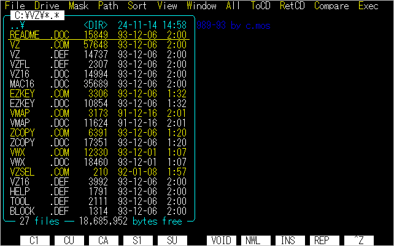

## ２.２ ディスクの中をのぞく

&emsp;もう一度VZを起動し、⏎のみ押してファイラーを開いてください。カレント・ディレクトリのファイルの一覧が表示されています。

&emsp;MS-DOSの「ディレクトリ」と「ファイル」についてはご存じですか？　ファイル名の横に\<DIR\>とついているものがディレクトリ、サイズが表示されているものがファイルです。[↓],[↑]で、ディレクトリの上へカーソルを移動し、⏎を押してみてください。そのディレクトリを表示しましたね。一番上の「..¥ \<DIR\>」は、「親ディレクトリ」を表します。ここで⏎を押すと、ひとつ上のディレクトリへ戻ります。\<DIR\>のところで⏎、これでディスクの中を自由に渡り歩けるのです。

&emsp;別のドライブに移動したい場合は、[**D**]（一番上のメニューのDrive）を押してドライブのメニューを表示し、ここで選択してください。カーソルを移動して⏎でも、ダイレクトにドライブ名に相当する英字キーを押しても選択できます。

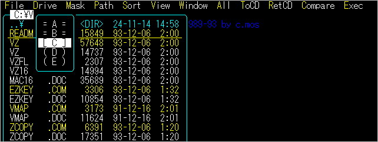

ファイラーのその他のメニューについては、「5.4ファイラーの操作」で説明します。

&emsp;それでは、VZで読み込むファイルを選択しましょう。ファイルには、テキストファイルと、バイナリファイルがある事はご存じですか？　バイナリファイルは、次のような拡張子（ピリオドの後の3文字の英字）をもつファイルです。
	.COM .EXE .FNT .SYS（CONFIG.SYSを除く）
これらはVZでは編集できません。読み込むと、画面にでたらめな文字が表示されます。 　VZが編集できるファイルは、テキストファイルです。次の拡張子をもつファイルが、その代表です。
	.DOC .TXT .BAT .DEF（VZ独自の拡張子）

&emsp;[↓],[↑]でテキストファイルのところへカーソルを移動し、⏎を押してください。ファイルを読み込み、画面に表示します。これを「編集画面」と呼びます。

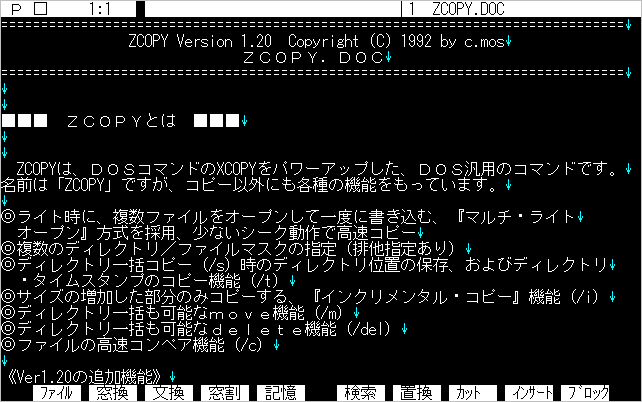

&emsp;画面の一番上に、記号と数字、ファイル名などが表示されていますね。これを、「ステータス・ライン」と呼びます。この意味については折りに触れて説明します。

&emsp;再びファイラーに戻る時は、[**ESC**][**C**]を押します。Cは「Close」の意味です。

&emsp;[**ESC**][**C**]で閉じようとした時、画面の一番下に

	"..."を出力しますか？ (Y/N)

と表示されるかも知れません。これは、誤って何か文字を入力してしまったためです。このまま出力すると、ファイルが書き変わってしまいますから、必ず[**N**]または[**Space**]を押してください。

&emsp;このようにして、まずはディスクの中のいろいろなテキストファイルをのぞいてみましょう。

## ２.３ カーソルの移動とスクロール

&emsp;ファイルを読み込むと、画面の左上でチカチカ点滅しているものがあります。これを「カーソル」と呼び、文字を入力したり、削除したりする位置を示しています。このカーソルを動かしてみましょう。

&emsp;カーソルを動かすキーは、[↑],[↓],[←],[→],[**Home**],[**End**],[**PgUp**],[**PgDn**]です。[**Ctrl**]や[**Shift**]を押しながらこれらのキーを押すと、違う動作になります。
### ■ カーソルの移動とスクロール
|キー|機能|
|---|---|
|[←]／[→]|左／右に1文字単位で|
|[↑]／[↓]|上／下に1行単位で|
|[**Shift**]+[←]／[→]|前／後の単語の先頭へ|
|[**Ctrl**]+[←]／[→]|論理行頭／行末へ|
|[**GRPH**]+[←]／[→]|画面の左端/右端へ|
|[**Home**]／[**End**]|&emsp;同上 (IBM版)|
|[**Ctrl**]+[↑]／[↓]|画面の上端／下端へ|
|[**Shift**]+[↑]／[↓]|前画面／次画面へ (98版)|
|[**PgUp**]／[**PgDn**]|&emsp;同上 (IBM版)|
|[**Shift**]+[**RLUP**]／[**RLDN**]|1行スクロール|
|[**RLUP**]／[**RLDN**]|スムース・スクロール (98版)|
|[**Shift**]+[↑]／[↓]|高速スクロール (IBM版)|
|[**Ctrl**]+[**RLUP**]／[**RLDN**]|ファイルの先頭／最後|

&emsp;README.DOC等の大きめのファイルを読み込んで、実際に操作してみてください。

**【疑似フリーカーソル】** 
&emsp;行末（↓で表される改行マークの上）で[→]を押すと、カーソルはそれより右へは移動せず、次の行の先頭に移ります。ワープロ等では、そのまま右に移動できるものもありますね。これを「フリーカーソル」機能といいます。VZでは、この機能はサポートしていません。 　ただ、上下にスクロールした結果、その行が前の行より短い時には、カーソルは行末以降に留まっています。これはカーソルが左右に振れて見づらくならないための配慮で、内部的にはカーソルは行末に位置しています。

**【ステータス・ライン】** 
&emsp;カーソルを移動すると、ステータス・ラインの数値や真ん中のブロックの位置が変わりますね。数字は、「行番号：カラム位置」を示し、ブロックは、テキスト中のカーソル位置の目安を示します。

**【論理行と表示行】** 
&emsp;テキストの改行から改行までを「論理行」、画面上の1行を「表示行」といって区別します。[**Ctrl**]+[←]／[→]は「論理行」の先頭／最後へカーソルを移動するわけです。

**【日本語の単語境界】** 
&emsp;日本語の文章では、英文のような単語の区切りが明確ではありません。この時、[**Shift**]+[←],[**Shift**]+[→]は、ひらがなをスキップし、前／後の漢字・カタカナ・英数字の頭へ移動します。

## ２.４ 文字の入力と削除

&emsp;ファイルを眺めるのにも、そろそろ飽きてこられましたか。それでは、エディタの本分とでも言うべき、文字の入力と編集機能の説明に入ります。 　これまでは、既にあるファイルを読んできましたが、今回はまず新しいファイルを作りましょう。VZを起動し、『入力ファイル』のウインドウで、適当な名前（例えば「example」）を入力して、⏎キーを押してください。すると、

	"C:¥VZ¥EXAMPLE"は見つかりません. 新規ファイルですか？ (Y/N)

と聞いてきますから、[**Y**]または⏎を押します。編集画面に移り、画面の左上にカーソルが点滅していますね。新規ファイルですから、まだ何も書かれていないわけです。 　この時、カーソルの点滅しているところの記号（左向きの三角形）が、ファイルの最後を示すマークです。（「End Of File」略してEOFマークと呼びます。）この状態で、入力の練習を始めましょう。

&emsp;キーボードには、白い（または黒い）キーと、その周りの灰色っぽいキーがありますね。灰色のキーは、カーソル移動やスクロールのようなコマンドを実行するのに使います。これらのキーを「特殊キー」と呼びます。文字の入力は、白いキーで行います。適当なキーを押してください。英数字、記号が入力できますね。[**Shift**]を押すと、英字キーでは大文字、数字や記号キーでは上側の記号が入ります。

&emsp;適当に文字を入力したら、⏎を押してください。改行され、カーソルが次の行の先頭に来ます。また、入力した文字は、⏎の上の[**BS**]（バックスペース）で、1文字ずつ削除できます。この⏎と[**BS**]が、テキストの入力に使われる最も基本的なキーです。 　⏎で改行する代わりに[**Shift**]+⏎を押すと、カーソル位置の行の前に、空行（改行だけの行）が1行挿入されます。カーソルを移動せずに間を開けたい場合は、こちらの方が便利です。
### ■ 改行コードの挿入
|キー|機能|
|---|---|
|⏎|改行|
|[**Shift**]+⏎|1行挿入|

&emsp;半角英数字の入力方法はおわかりになりましたね。では、日本語はどうやって入力するのでしょう。残念ながらVZ自体には、日本語を入力する機能はありません。従って、FEP（フロント・エンド・プロセッサ）と呼ばれるアプリケーション・ソフトの助けを借ります。

&emsp;VZには、[**BS**]以外にも、いろいろな削除機能があります。これらを試すには、テキストファイルを読み込んだ方が楽です。「VZ.DEF」を読み込んでください。
### ■ 文字の削除と復活
|キー|機能|
|---|---|
|[**BS**]|カーソルの左の1文字削除|
|[**DEL**]|カーソル位置の1文字削除|
|[**Shift**]+[**BS**]|単語の先頭まで削除|
|[**Shift**]+[**DEL**]|単語の最後まで削除|
|[**Ctrl**]+[**BS**]|行頭まで削除|
|[**Ctrl**]+[**DEL**]|行末まで削除|
|[**Ctrl**]+[**U**]|削除文字の復活|

&emsp;削除した文字は、100文字程度まで記憶されており、[**Ctrl**]+[**U**]を押すと順番にカーソル位置に復活してきます。Uは「Undo」（もとに戻す）の意味です。 　この練習ででたらめな文字を入力したファイルは、セーブする必要はありませんから、[**ESC**][**C**]で終了しましょう。Cは「Close」の意味です。

	"C:¥VZ¥EXAMPLE"を出力しますか？(Y/N)

と聞いてきますから、[**N**]または[**Space**]を押してください。編集中のファイルは捨てて、VZを終了します。

&emsp;ファイルを編集すると、ステータス・ラインのファイル名の前に、「*」マークがつきます。これは、「ファイルが書き変えられた」事を示しています。ファイルが書き変えらた時だけ、[**ESC**][**C**]や[**ESC**][**Q**]で終了しようとすると、セーブすべきか、あるいは放棄していいかどうか確認してくるわけです。

## ２.５ ファイルメニュー

&emsp;編集操作を一通り説明したところで、ファイルの読み書きのいろいろな方法について説明します。まず、適当なファイルを読み込み、編集画面に移ってください。ここで、キーボード最上段のファンクションキー[**F1**]を押してください。次のようなメニューが現れます。

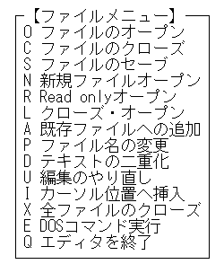

&emsp;メニューの各コマンドは、カーソルを移動して⏎で実行できます。カーソルをいちいち移動するのが面倒な時は、先頭の英字キーを押してください。また、メニューを開かずとも、編集画面から[**ESC**][**英字**]で直接実行することもできます。IBM版では[**Alt**]+[**英字**]も使えます。98版でも、付属のEZKEY.COMを常駐することにより、[**GRPH**]+[**英字**]が使えるようになります。

&emsp;では、ファイルメニューの各コマンドを順番に説明していきましょう。コマンドは「Open」などの略語で表すことにします。
### ■ O ファイルのオープン（Open）
&emsp;現在編集中のファイルの他に、新たに別のファイルを読み込みます。コマンドを実行すると、VZを起動した時と同じ『入力ファイル』ウインドウが現れますから、読み込むファイルを指定して下さい。 　ファイルを読み込むと、前のファイルに代わって画面に表示されます。ステータス・ラインのファイル名の前の数字が、「2」になりましたね。これは、2番目のファイルという意味です。このようにVZは、標準設定で最大10個までのファイルを一度に読み込めます。複数ファイルの操作は、次の節で説明します。
### ■ C ファイルのクローズ（Close）
&emsp;現在編集中のファイルをクローズします。2番目のファイルを編集中は、これを閉じて1番目のファイルを表示します。最後のファイルをクローズすると、ファイラーまたは『入力ファイル』ウインドウに戻ります。 　ファイルが書き変わっている場合は、クローズする前に

	"..."を出力しますか？ (Y/N)

と聞いてきますので、以下のキーを押してください。

|キー|機能|
|---|---|
|[**Y**],⏎|セーブする|
|[**N**],[**Space**]|セーブしない|
|[**ESC**]|コマンドの実行を中止する|
### ■ S ファイルのセーブ（Save）
&emsp;編集中のファイルをセーブします。コマンドを実行すると、『出力ファイル』というウインドウが現れ、ファイル名が表示されます。名前を変えてセーブしたい時は、これを修正し、⏎を押してください。セーブが完了すると、再び編集画面に戻ります。 　後で説明するブロックモードでSaveコマンドを実行すると、ブロックの指定範囲を、ファイルにセーブできます。
### ■ Q エディタを終了（Quit）
&emsp;VZを終了します。編集中の複数のファイルの中に、修正したファイルが1つでもあると、
	修正テキストを出力しますか？ (Y/N)

と聞いてきますので、以下のキーを押してください。
|キー|機能|
|---|---|
|[**Y**],⏎|全ての修正ファイルをセーブする|
|[**N**],[**Space**]|何もセーブしない|
|[**ESC**]|コマンドの実行を中止する|
### ■ E DOSコマンド実行（Exec）
&emsp;DOSコマンドを実行します。コマンドを実行すると、VZを起動する前の画面に戻り、画面の一番下にプロンプトが現れます。この状態を「コマンドライン・モード」と呼びます。ここで、実行したいDOSコマンドを入力し、⏎を押してください。⏎のみ押すと、COMMAND.COMを呼び出します。この場合は「exit⏎」でVZのコマンドライン・モードへ戻ってください。 　入力には、カーソル移動や削除等の編集操作が行なえます。VZに戻る時は、[**ESC**]を押します。

&emsp;以上の5つのコマンドが基本的なコマンドです。これ以降のコマンドは、とりあえず知らなくても構いませんから、お急ぎの方は読み飛ばして先へ進んでください。
### ■ N 新規ファイルオープン（New）
&emsp;これは、新しいテキストを書き始める時に使います。コマンドを実行すると、『新規ファイル』というウインドウが現れますから、ファイルの名前を入力して⏎を押してください。 　Openコマンドで新しいファイル名を指定しても、新規ファイルを開けますが、こちらは「新規ファイルですか？」といちいち聞いてきません。
### ■ R Read onlyオープン（Read）
&emsp;壊してはまずいような大事なファイルを読む場合は、このコマンドでファイルを開きます。ステータス・ラインが水色になり、ファイル名の前に「R」のマークがつきます。これは「Read only」の意味です。リードオンリ・モードのファイルは、書き換えても、クローズする時にセーブするかどうか聞いてきません。当然セーブもできません。 　リードオンリ・モードは、編集中に[**Ctrl**]+[**K**][**R**]で設定／解除出来ます。これは、[**Ctrl**]を押したまま、[**K**][**R**]と順番に押してください。
### ■ L クローズ･オープン（Load）
&emsp;すでにいくつかのファイルを読み込んでいる時に、別の複数のファイルを順番に読みたい時に便利です。コマンドを実行すると、編集中のファイルをクローズし、ファイラーに戻って、次のファイルをオープンできます。
### ■ A 既存ファイルへ追加（Append）
&emsp;編集中のファイルを、ディスク上の別のファイルの後ろへ追加します。コマンドを実行すると、『追加ファイル』というウインドウが現れますから、追加したいファイルを指定してください。ここで⏎のみ押すと、ファイラーが開きますので、そこで選択する事もできます。

&emsp;セーブと同様に、ブロックモードでAppendコマンドを実行すると、ブロックの指定範囲を、ファイルに追加できます。
### ■ P ファイル名の変更（Pathname）
&emsp;編集中のファイルの名前を変更します。コマンドを実行すると、『ファイル名』というウインドウが現れ、ファイル名が表示されます。名前を変えて⏎を押してください。 　このコマンドを実行すると、ファイルは修正されたことになり、「*」マークがつきます。
### ■ U 編集のやり直し（Undo）
&emsp;編集を放棄し、もう一度ディスクからファイルを読み込みます。
### ■ I カーソル位置へ挿入（INSert）
&emsp;カーソル位置へファイルを読み込みます。コマンドを実行すると、

	カーソル位置へファイルを読み込みます

というメッセージとともに、Openコマンドと同様に『入力ファイル』というウインドウが現れますので、読み込むファイルを指定してください。
### ■ D テキストの二重化（Duplicate)
### ■ X 全ファイルのクローズ（eXit）
&emsp;次のマルチファイルの節で説明します。

## ２.６ マルチファイル

&emsp;VZは、標準設定で最大10個のファイルをメモリに読み込めます。そのうち1つまたは2つのファイルを画面に表示できます。このように、複数のファイルを同時に編集できるエディタを、「マルチファイル・エディタ」といいます。

&emsp;複数のファイルは、Openコマンドで順番に読み込めますが、一度に読み込む事もできます。まずその方法について説明しましょう。 　VZを起動し、ファイラーを開いてください。そして、読み込みたいテキストファイルが複数あるディレクトリを表示してください。例えば、VZをインストールしたディレクトリには、拡張子が「.DEF」のファイルがいくつかあります。これらを読み込んでみましょう。カーソルをそのファイルの上に移動し、[**Space**]を押します。その行が反転します。もう一度[**Space**]を押すと元にもどります。このように、読み込むファイルをいくつか選択したら、⏎を押します。選択したファイルをすべて読み込み、最後に読み込んだファイルを画面に表示します。 　[**Space**]で1つ1つ選択する代わりに[**Shift**]+[↓],[↑]で選択しながらカーソルを移動することもできます。 　このようにして、まず複数のファイルを読み込んでください。

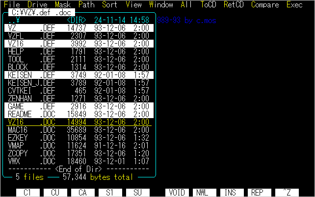

&emsp;マルチファイルの操作は、主にファンクションキーで実行できます。
### ■ マルチファイル
|キー|機能|
|---|---|
|[**F2**]  (窓換)|ウインドウの切り替え|
|[**F3**]  (文換)|編集テキストの切り替え|
|[**F4**]  (窓割)|画面の分割モードの切り替え|
|[**Shift**]+[**F4**]  (窓割)|分割位置の変更|
|[**ESC**][**D**]|テキストの二重化	|
|[**ESC**][**X**]|全ファイルのクローズ|
### ■ ウインドウの切り替え（窓換）
&emsp;2つ以上のファイルを読み込んだ後[**F2**]を押すと、最後に読み込んだファイルと、その1つ前に読み込んだファイルとが、替わる替わる表示されます。このように、複数のファイルのうちの2つのファイルを切り替えるのが、このコマンドです。
### ■ 編集テキストの切り替え（文換）
&emsp;[**F3**]を押すと、次のような読み込んだファイルのメニューが表示されます。

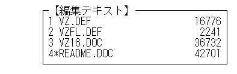

見たいファイルへカーソルを移動して⏎を押すか、直接数字を入力してください。そのファイルを表示します。[**F3**]を続けて2回押すと、その次のファイルに切り替わります。
### ■ 画面の分割モードの切り替え（窓換）
&emsp;複数のファイルを読み込んだ状態で[**F4**]を押すと、

	全画面 → 横2分割 → 縦2分割 → 全画面

のように分割モードが切り替わります。

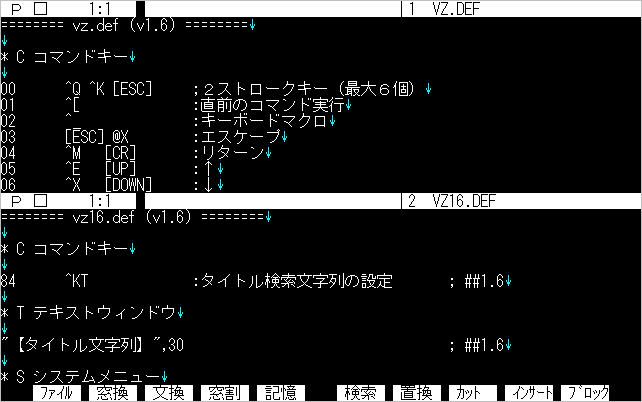

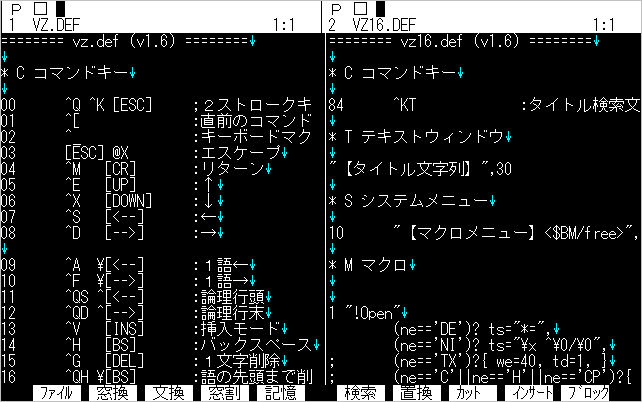

### ■ 分割位置の変更（窓割）
&emsp;[**Shift**]+[**F4**]で2画面分割モードにした時の分割位置を変更します。コマンドを実行すると、

	カーソルキーで位置を移動して[ﾘﾀｰﾝ]

と表示されますから、[↑],[↓]または[←],[→]キーで境界線を移動し、⏎を押してください。

### ■ D テキストの二重化（Duplicate）
&emsp;ファイルメニューのコマンドです。編集中のファイルをさらにもう1つ、ディスクから読み込み、画面を横分割して下側に表示します。これは、同じファイルの別の部分を見ながら編集したい場合、あるいは、編集した結果とオリジナルのファイルとを見比べたい場合に便利です。下側のファイルは「ビューモード」でオープンされ、編集できなくなっています。 　もう一度Duplicateコマンドを実行すると、元にもどります。
### ■ X 全ファイルのクローズ（eXit）
&emsp;読み込んだファイルを1つずつクローズしていきます。その中に修正したファイルがある度に、セーブするかどうか聞いてきます。全部のファイルをクローズすると、ファイラーまたは『入力ファイル』ウインドウに戻ります。

## ２.７ カット＆ペースト

&emsp;カット＆ペーストは、エディタの編集操作の最も重要な部分です。VZでも、特にこの機能には工夫を凝らしていますので、じっくり習得してください。

&emsp;カット＆ペーストは、行単位またはブロック単位で行えます。VZでは、この2種類をブロックの範囲を指定しているかどうかで切り分け、共通のコマンドで操作できるようになっています。それは、次の5つのコマンドです。
### ■ カット＆ペースト
|キー1|キー2|機能|
|---|---|---|
|[**F12**] (ブロック)|[**Ctrl**]+[**B**]|ブロックモードの指定|
|[**F8**] (カット)|[**Ctrl**]+[**Y**]|行・ブロック削除|
|[**F9**] (インサート)|[**Ctrl**]+[**J**]|行・ブロック挿入|
|[**Shift**]+[**F8**] (コピー)|[**Ctrl**]+[**K**][**K**]|行・ブロック記憶|
|[**Shift**]+[**F9**] (ペースト)|[**Ctrl**]+[**K**][**C**]|行・ブロック複写|

&emsp;このように、カット＆ペーストは、ファンクションキー、[**Ctrl**]+[**英字**]キーで操作します。

&emsp;では、適当なファイル（例えば「VZ.DEF」）を読み込んで練習してみましょう。[**Ctrl**]+[**Y**]を押すと1行削除されます。続けて何回か押して、何行か削除してください。今度は、[**Ctrl**]+[**J**]を押します。最後に削除した行が出てきましたね。続けて押すと、削除した行が順番に復元され、テキストは最初の状態に戻ります。

&emsp;削除した行またはブロックは、「テキストスタック」と呼ばれる領域に順次記憶されます。この領域は64KBの大きさがあり、いっぱいになると古いものから自動的に捨てられていきます。

&emsp;今度は、[**Ctrl**]+[**K**][**K**]を実行します。[**Ctrl**]を押したまま、[**K**]を2回押してください。画面上では何も変化がありませんが、これでカーソル位置の1行をテキストスタックに記憶しました。[**Ctrl**]+[**K**][**C**]を押すと、その行を挿入します。しかし、[**Ctrl**]+[**J**]と違いテキストスタックにもそのまま残りますから、[**Ctrl**]+[**K**][**C**]を何度も押して、同じ行をいくつも複写できます。 　次に、ブロックを指定してみましょう。まずは行単位のブロックです。ブロックにしたい先頭の行へカーソルを移動し、[**Ctrl**]+[**B**]を押します。ステータス・ラインの左にある「□マーク」が反転し、ブロックモードになった事を示します。もう一度[**Ctrl**]+[**B**]を押すと元にもどります。 　ブロックモードにしたら、[↓]を押してください。ブロックの部分が異なる色で表示されますね。そのまま[↓]を押しつづけ、何行かブロック指定してください。

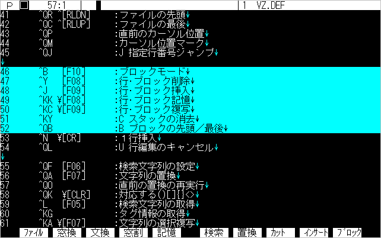

ここで[**Ctrl**]+[**Y**]を押すと、ブロックを削除します。もちろん[**Ctrl**]+[**J**]で元に戻ります。行単位で削除した場合と同様に、削除したブロックは、テキストスタックに順次記憶されます。このように、テキストのある部分を、別のところへコピーする一連の操作は、
1. [**Ctrl**]+[**B**]でブロック先頭マーク
2. [↓]で範囲指定
3. [**Ctrl**]+[**K**][**K**]でブロックを記憶
4. 挿入したいところへカーソルを移動
5. [**Ctrl**]+[**J**]で挿入
となります。

&emsp;次に、文字単位のブロックを指定します。同じように[**Ctrl**]+[**B**]でブロックモードにして、今度は[→]でカーソルを右に移動してください。その間がブロック指定されましたね。これも行単位のブロックと同様にカット＆ペーストできます。 　複数行にわたる文字単位のブロックは、[↓]で範囲指定した後、[←],[→]で文字境界までカーソル移動してください。

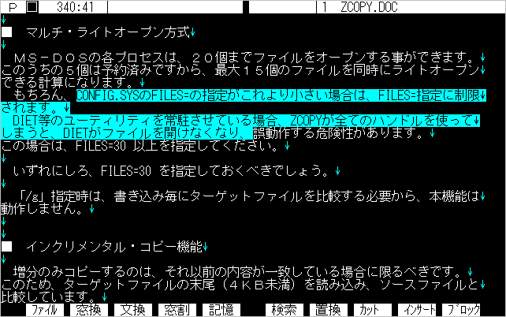

&emsp;このように、画面のブロック表示が、画面の右端までか、各行の行末までかで、行単位のブロックか文字単位のブロックかが判別できます。ブロックの操作には、この他にも「矩形ブロック」があります。これについては、「4.6 矩形ブロック」で説明します。
**【大きなブロックの削除】** 
&emsp;一度に64KB以上のブロックを削除しようとすると、

	ブロックが大きすぎます

と表示され、64KBに収まる範囲のみ削除されて、残った部分はブロックのまま残します。これは、テキストスタックに64KB分しか保存できないためです。そのまま削除してもよい場合は、全部削除できるまで、[**Ctrl**]+[**Y**]を続けて押してください。

**【直前のコマンド実行】** 
&emsp;[**Ctrl**]+[**K**][**C**]などの2ストロークコマンドは、続けて何度も実行させる時には不便です。こんな時は、[**Ctrl**]+[**[**]（[**Ctrl**]キーを押しながら[**[**]（左括弧））を使いましょう。直前に実行したコマンドを、ワンキーで実行できます。
### ■ 直前のコマンド実行
|キー|機能|
|---|---|
|[**Ctrl**]+[**[**]|直前のコマンド実行|

## ２.８ 検索と置換

&emsp;文字列の検索方法は、一風変わっていますので、注意が必要です。
### ■ 文字列の検索
|キー1|キー2|機能|
|---|---|---|
|[**F6**] (検索)|[**Ctrl**]+[Q[**F**]|検索文字列の設定|
||[**Ctrl**]+[**C**]/[**Ctrl**]+[**R**]|前方／後方検索|
|[**Shift**]+[**INS**]|[**Ctrl**]+[**@**]|ページングモードの切替え (98版)|
|[**Shift**]+[**INS**]|[**Ctrl**]+[**2**]|ページングモードの切替え (IBM版)|
|[**F5**] (記憶)|[**Ctrl**]+[**L**]|検索文字列の取得|

&emsp;まず、練習用に「VZ.DEF」を読み込みましょう。そして、[**Ctrl**]+[**Q**][**F**]を実行すると、次のようなウィンドウが現れます。

ここで検索したい文字列を入力します。例えば、「F06」と打ってみましょう。打ち終わったら⏎です。この時点では、まだ検索は実行されません。ステータス・ラインの左端に「S」という反転マークを表示し、画面の下に「F06」という検索文字列を表示しています。 　この状態で、[**Ctrl**]+[**C**]を押してください。「F06」を検索し、カーソルを移動します。もう一度[**Ctrl**]+[**C**]を押すと、次の「F06」を検索します。もう一度押すと、その先には「F06」がないため、

	文字列が見つかりません

と表示されます。今度は、[**Ctrl**]+[**R**]を押してみましょう。最初の「F06」を検索します。もう一度押すと、その前にもありませんから、「見つかりません」と出ます。

&emsp;このように、VZでは、[**Ctrl**]+[**Q**][**F**]で検索文字列を設定した後、[**Ctrl**]+[**C**],[**Ctrl**]+[**R**]で検索するのです。検索を終了して、通常のページング機能へ戻す時には、[**Shift**]+[**INS**]を押します。ステータス・ラインの表示が「P」に戻りましたね。もう一度押すと、今度は「C」になります。この状態は、第4章で触れる「タイトルサーチ」モードです。もう一度押すと、再び「S」の反転に戻り、検索文字列が画面の下に表示されます。 　すなわち、[**Shift**]+[**INS**]コマンドで、[**Ctrl**]+[**C**],[**Ctrl**]+[**R**]の動作を3モードで切り替えるのです。

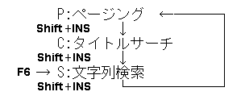

&emsp;検索文字列は、テキストから取得する事もできます。[**Ctrl**]+[**L**]を実行してください。カーソル位置の単語が検索文字列として取得され、検索モードになります。続けて[**Ctrl**]+[**L**]を押すと、その右の単語を加えた長い文字列になります。このように、どんどん長い文字列を取得できます。 　また、ブロックモードにして[**Ctrl**]+[**L**]を実行すると、ブロック範囲を検索文字列として切り出せます。

&emsp;このようにして、テキストからいろいろな検索文字列を取得したら、もう一度[**Ctrl**]+[**Q**][**F**]を実行してください。そして、『検索文字列』のウインドウで、[↑]を押してください。最後に取得した文字列が表示されましたね。[↑]を何度か押すと、記憶されている検索文字列が順次現れます。この機能を「ヒストリー機能」と呼びます。これについては第4章で触れます。次の文字列の置換では、このヒストリー機能を使うと、より簡単に文字列を入力できますから、ここで一言触れておきました。

&emsp;検索の次は置換です。
### ■ 文字列の置換
|キー1|キー2|機能|
|---|---|---|
|[**F7**] (置換)|[**Ctrl**]+[**Q**][**A**]|文字列の置換|
|[**STOP**]|[**Ctrl**]+[**Break**]|置換の中断|

&emsp;コマンドを実行すると、『検索文字列』というウインドウが開きますので、検索したい文字列を入力します。カーソル位置に、置換したい文字列がある時は、まず[**Ctrl**]+[**L**]で取得しておき、置換コマンドの『検索文字列』のところで、[↑]で選択した方が楽です。⏎を押すと、今度は『置換文字列』というウインドウが開きます。ここで置換したい文字列を入力するわけですが、もし、検索文字列の一部を修正したような文字列の場合には、[↑]で検索文字列を表示し、これを編集できます。 　置換文字列が準備できたら、再び⏎を押します。すると次のようなメニューが現れます。

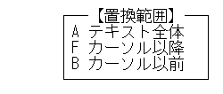

通常は「A テキスト全体」でしょうから、そのまま⏎を押します。そして最後に、

	全部一度に置換しますか？ (Y/N)

と聞いてきますので、以下のキーを押してください。

|キー|機能|
|---|---|
|[**Y**],⏎|確認せず一気に置換する|
|[**N**],[**Space**]|1つずつ置換するかどうか確認する|
|[**ESC**]|コマンドの実行を中止する|

置換が完了すると、

	xx個の文字列を置換しました

と表示します。

&emsp;置換は同じ長さの文字列であればほとんど瞬時に完了します。それでも、大きなファイルでたくさんの文字列を置換すると、かなりの時間がかかるかも知れません。本当に置換しているのか、ハングアップしてしまったのか心配になった時は、[**STOP**]で中断してください。 　置換は、ブロックモードでは、ブロック内で実行されます。この場合、置換範囲は聞いてきません。

**【複数テキストで検索･置換】** 
&emsp;編集中の全ファイルに対して、検索や置換を行なうことができます。検索、または置換コマンドを実行した後、次のコマンドを実行してください。
### ■ 複数テキストで検索･置換
|キー|機能|
|---|---|
|[**Shift**]+[**F6**] (マルチ)|複数テキストで検索･置換|

**【検索オプションメニュー】** 
&emsp;検索文字列のウィンドウから[**Shift**]+[**F1**]を押すと、次のようなメニューが現れます。

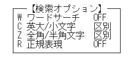

&emsp;ここで検索オプションを設定できます。設定したオプションは、<OPT:>で表示されます。 　下の2つのメニュー項目は、VWX.COMを常駐している時にだけ現れます。VWX.COMについては、第10章をご参照ください。
### ■ W ワードサーチ
&emsp;文字列検索で「key」という単語を検索する場合、ワードサーチがONになっていると、「keys」という単語は検索しません。これは、プログラムで「i」という変数名だけを検索したい場合等に便利です。ワードサーチをOFFにすれば、その前後の文字よらず、すべて検索します。また、ワードサーチがONになっていても、「key*」というように前後に「*」をつければ、そちら側のワード境界は無視します。検索文字が日本語や記号の場合は、ワードサーチとはなりません。

## ２.９ モードメニュー

&emsp;編集画面で[**Shift**]+[**F1**]を押してください。次のメニューを表示します。

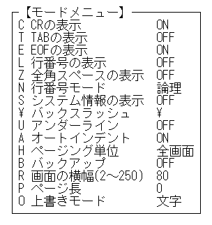

1つずつカーソルを移動して、⏎を押してみてください。画面の表示方法が変わったり、各種のモードが変わります。画面の表示は見ればわかりますから、他のモード切り替えについて説明しましょう。

&emsp;なお、ここで切り替えたモードは、VZを終了すれば初期設定に戻ってしまいます。初期設定のモードを変更したい場合は、第2章で触れたように、DEFファイル（VZ.DEF）のオプション指定を直接書き換えるか、3章で説明するプロファイル機能を利用してください。
### ■ N 行番号モード
&emsp;改行から改行までを1行と数える（論理行番号）か、画面上の1行で数える（表示行番号）かを切り替えます。表示行番号モードにすると、ステータス・ラインの行番号の後ろの記号が、「:」から「|」に変わります。このモードでは、行番号の計算に時間がかかるため、ジャンプの速度が遅くなります。
### ■ S システム情報の表示
&emsp;通常ステータスラインの中ほどには、テキスト中のカーソルイチを示す「インジケータ」が表示されていますが、このメニューでシステム情報の表示に切り替わります。

	［ 20h ］   1024  50% (   0) 400K

|項目|説明|
|---|---|
|［ 20h ］  |カーソル位置の文字コード|
|1024|編集テキストのサイズ|
|50%|テキスト中のカーソル位置|
|(   0)|テキストスタックのサイズ|
|400K|DOSメモリの残り容量(KB)|

### ■ B バックアップ
&emsp;バックアップをONにすると、セーブ時に、元のファイルの拡張子を「.BAK」に変えて残します。環境変数「VZBAK」が設定されていると、「.BAK」にリネームする代わりに、そのディレクトリへ移動します。
### ■ R 画面の横幅(2～250)
&emsp;通常は1画面80字で折り返されますが、これを設定すると最大250文字まで横スクロールします。
### ■ P ページ長
&emsp;表示行番号モードの時、通し行番号の代わりに、ページ番号とそのページ内での行数で表示します。実際にページの管理をしているわけではなく、単純に割り算しているだけです。
### ■ O 上書きモード
 [**INS**]キーを押すと、入力した文字はテキスト上の文字に上書きされます。初期設定では「文字対応」で上書きされますので、全角・半角・TABコードによってカーソル位置より右のテキストは、ずれてしまいます。このメニューで「桁対応」に切り替えると、テキストはずれません。

## ２.１０ ヘルプ

&emsp;では、この章の最後にVZのヘルプシステムについて説明しておきます。編集画面で、[**HELP**]または[**F12**]を押してみてください。

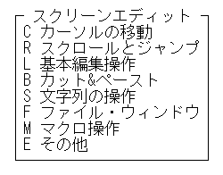

最初のメニューを選んでみましょう。

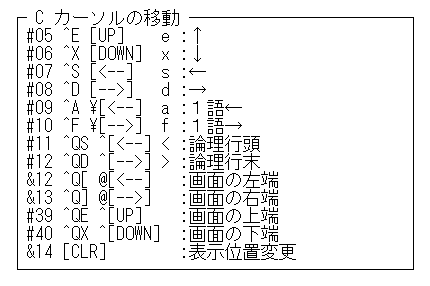

各コマンドの先頭の「#..」という数字はコマンド番号、「&..」はマクロ番号です。その後がキーアサインです。ここでの「^ ¥ @」という記号は、それぞれ

|記号|キー|
|---|---|
|^| [**Ctrl**]|
|¥| [**Shift**]|
|@| [**GRPH**]または[**Alt**]|

を表します。 　コマンドのメッセージの前に、1文字の英字、英記号がついているものがありますが、これはマクロで記述する際の略号です。

&emsp;ヘルプメニューを表示している時に、カーソルキー、⏎、[**ESC**]以外のコマンドキーを押すと、ただちに該当するキーの説明を表示します。例えば、[**F5**]を押すと

という具合です。続けて他のコマンドキーを押せば、その説明に変わります。⏎でヘルプメニューへ戻ります。

&emsp;VZのヘルプシステムは、特別のヘルプファイルを読み込むわけではなく、起動時に読み込んだDEFファイル中のコメントを表示しています。ですから、詳しい説明は表示されません。

