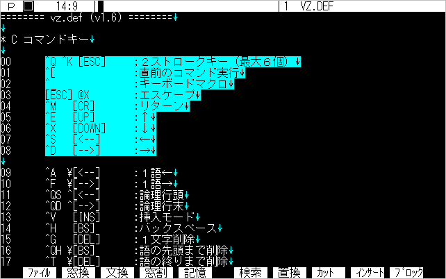
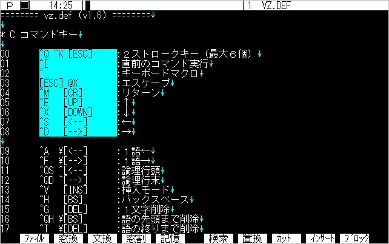
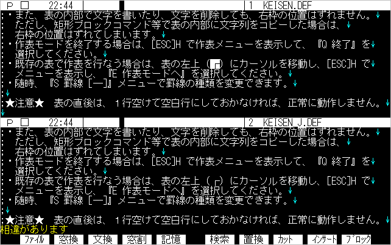

# 第４章 スクリーンエデット

## ４.１ ページングとタイトルサーチ
### ■ ページングモード

&emsp;通常、[**Ctrl**]+[**R**],[**Ctr**]+[**C**]のページングは、全画面／半画面単位で動作します。これを「画面ページングモード」と呼びます。VZでは、この他に、特定の見出しをサーチする「タイトルサーチモード」と、検索文字列をサーチする「文字列検索モード」の計3つのページングモードがあります。これらは[**Ctrl**]+[@]で切り替えて操作します。
### ■ ページング機能

（98版）
|キー1|キー2|機能|
|---|---|---|
|[**Shift**]+[↓]|[**Ctrl**]+[**C**]|ページダウン|
|[**Shift**]+[↑]|[**Ctrl**]+[**R**]|ページアップ|
|[**Shift**]+[**INS**]|[**Ctrl**]+[@]|ページングモードの切替え|

（IBM版）
|キー1|キー2|機能|
|---|---|---|
|[**PgDn**]|[**Ctrl**]+[**C**]|ページダウン|
|[**PgUp**]|[**Ctrl**]+[**R**]|ページアップ|
|[**Shift**]+[**INS**]|[**Ctrl**]+[**2**]|ページングモードの切替え|

&emsp;現在のページングモードは、ステータス・ラインの左端の［P］［C］［S］の記号で表示されています。

#### ［P］：画面ページングモード
&emsp;全画面または半画面単位でページングします。全画面か半画面かは、モードメニュー、またはオプション***Eh***で指定できます。

	Eh-		全／半画面ページング

#### ［C］：タイトルサーチモード
&emsp;特定の見出し行をサーチします。（CはCommentの頭文字です） 
&emsp;Ver1.6で強化しました。

#### ［S］：文字列検索モード
&emsp;[**Ctrl**]+[**Q**][**F**]で設定した文字列を検索します。

&emsp;各モードは、次の様に切り替わります。

- 検索文字列が設定されていない場合 
&emsp;　　　P→C→P ... 
- 検索文字列が設定されている場合 
&emsp;　　　P→C→S→P ... 

●タイトルサーチ機能を使わない場合は、オプション***Et***を「***-***」にしてください。 

	Et-			タイトルサーチ

&emsp;この場合は、［C］モードにはなりません。

### ■ タイトルサーチ

&emsp;タイトルサーチモードは、特定の見出し行を検索するモードです。次の行を見出し行と判断します。

&emsp;**行頭のスペース・タブを除いた最初の文字が「＊ / ; ^L ■」で、直前が空行（改行のみ）の行**

&emsp;見出し行の先頭文字（見出し文字）は、VZ.DEF で設定できます。

	* E その他
	7	*/;^L■

●Ver1.6では、全角文字も見出し文字にできます。 

［例］

	↓
	/* Main Routine */↓		← タイトル行
	main()↓
	...

	↓
	■ 第2章　VZひとめぐり	← タイトル行
	...

	↓
	* M マクロ↓			← タイトル行
	↓
	2  [F01] "【ファイルメニュー】"↓
	...

&emsp;さらにVer1.6では、テキスト毎に特定のパターンの文字列を、「タイトル検索文字列」として設定することができます。

■　タイトルサーチ 
|キー|機能|
|---|---|
|[**Ctrl**]+[**K**][**T**]|タイトル検索文字列の設定|

&emsp;VZ.DEFをオープンし、[**Ctrl**]+[**K**][**T**]を実行してください。

&emsp;ここで、「#⏎」と打ち込みます。ステイタス・ラインの左端の表示が［C］になりましたね。[**Ctrl**]+[**R**]、[**Ctrl**]+[**C**]を実行てみましょう。通常は「*」で始まる行をサーチしますが、今回は「#」で始まる行だけをサーチします。このように、VZ.DEF で設定した見出し文字を、変更できるわけです。

&emsp;もう一度[**Ctrl**]+[**K**][**T**]を実行し、「¥n1⏎」と打ち込んでみましょう。

今度は、「1」で始まる行にジャンプします。直前の行が空行でない行もサーチします。これは、「¥n1」を複数の見出し文字ではなく、検索文字列と認識したためです。タイトル文字列の先頭文字が「¥」または「^」の場合は、検索文字列として文字列検索を実行するわけです。

&emsp;もちろん、テキストを開くたびに見出し文字を設定するのは面倒です。このため、VZ.DEFの

	* M マクロ
	1 "!Open"

の個所で、オープンするファイルの拡張子に応じて、タイトル検索文字列を***ts***に設定しています。この「！Open」は、イベントマクロと呼ばれるもので、Ver1.6で新たにできた機能です。ファイルをオープンした時に、自動的に実行されるマクロです。これについては、マクロの章で詳しく説明します。

&emsp;タイトル検索文字列はテキスト毎に設定できますが、それぞれにテキストが検索文字列用のバッファを持っているわけはありません。ただポインタを持っているだけです。「！Open」マクロで設定した場合は、***ts***がマクロバッファの内のその文字列を指します。[**Ctrl**]+[**K**][**T**]で設定した場合は、1つしかない内部バッファを指しますので、複数のテキストで別のタイトル検索文字列を設定することはできません。[**Ctrl**]+[**K**][**T**]は、あくまで一時的なものとお考えください。

### ■ 画面上のカーソル位置の保存

&emsp;しばらくカーソルを動かしてみるとお気付きなると思いますが、VZでは画面上のカーソル位置を決める際に、カーソルの視点が移動しないようにいくつかの工夫をしています。

**【カラム位置の保存】** 
&emsp;[↑],[↓],[**Ctrl**]+[**W**],[**Ctrl**]+[**Z**]等で、カーソルが行末以降にくる場合、画面上ではカラム位置を変化させず、行末以降にカーソルを表示します。これは、上下スクロールしても、カーソルが左右に振れて見ずらくならないためです。行末以降にカーソルが表示されても、内部的にはカーソルは行末に存在していますので、エディットコマンド等を実行すると、カーソルは行末にあるものとして処理されます。この機能を禁止したい場合は、オプション***En＋***を設定してください。

	 En-		カーソルを行末以降に表示させない

**【行位置の保存】** 
&emsp;カーソルを画面の中央にもってきて、[**Ctrl**]+[**R**],[**Ctrl**]+[**W**]でテキストの先頭に移動してみてください。先頭行を表示すると、それ以降はカーソルが上に移動してしまいます。これでは、カーソルを画面の中央に位置させて、[**Ctrl**]+[**R**],[**Ctrl**]+[**C**]でテキストを眺めたい場合には不便です。このため、

&emsp;　**(A) 通常はカーソル表示位置の変化を伴わないカーソル移動コマンド** 
&emsp;　　　（ロールアップ／ダウン、ジャンプ系コマンド）

&emsp;　**(B) その他のカーソル移動を伴うコマンド**

という2つのグループにカーソル移動コマンドを分け、(B)グループのコマンド実行時にカーソルが上から何行目にあるかを保存し、(A)グループのコマンド実行時にそれを参照する、という方法を取り入れました。 　この機能はオプションで禁止することはできません。

## ４.２ スムーススクロール

&emsp;スムーススクロールは、PC-9800シリーズのもつハードウェアを生かして、ドット単位でテキスト画面をなめらかにスクロールする機能です。PC-9800のハイレゾモード、およびIBM版ではドット単位のスクロールできません。行単位の連続スクロール（速度可変）のみとなります。
### ■ スムーススクロール
|キー1|キー2|機能|
|---|---|---|
|[**RLDN**]|[Ctrl+[**Q**][**W**]|スムースアップ|
|[**RLUP**]|[Ctrl+[**Q**][**W**]|スムースダウン|
|[**Ctrl**]+[↑][↓]||画面の上端/下端へ|

&emsp;[**Ctrl**]+[↑][↓]を2回続けて実行しても、スムーススクロールが始まります。この機能はオプション***Es－***で止められます。

	Es-		^QE,^QX でスムーススクロール

&emsp;スムーススクロールは、起動した時のキーをそのまま押し続けるかどうかで、センスモードまたはラッチモードになります。ただしIBM版以外ではラッチモードのみです。

**【センスモード】** 
&emsp;実行キーを一定時間（約0.5秒）以上押し続けると、センスモードとなります。この時は、実行したキーを離すとスクロールが止まります。

**【ラッチモード】** 
&emsp;実行キーを即座に離した場合、そのままスクロールが続くラッチモードとなります。
ラッチモードでは、次のキーが使えます。それ以外のキーを押すと、スクロールは止まります。
|キー|機能|
|---|---|
|[**0**]～[**8**]|スクロール速度の変更（標準値3） 低速 ← 8,7,6,5,0,1,2,3,4 → 高速|
|[**Space**]|スクロールの一時停止|
|[**Shift**]|押している間、最高速（速度4）スクロールする 最高速の場合は速度3にとなる （センスモードでも有効）|

&emsp;スムーススクロール速度の初期値は、オプション***RS***で設定できます。

	RS3		スムーススクロール速度 (0..8)

- 2つのテキストを縦分割で表示している場合は、両画面スクロールとなります。この時、片方のテキストが先頭または最後に達すると、スクロールは止まります。

- 従来、スムーススクロール中は、改行コード等の色が、テキストと同じ色になりました。Ver1.6では、オプション***Dv***を「***+***」にすると、そのままの色でスクロールします。ただし、遅いマシンでは画面がちらつくようになる場合があります。IBM版では標準設定で***Dv＋***となっています。

- DOS／V版とJ3100版では、スクロール時に画面の上端／下端がちらつきます。これはハードウェア・スクロールの影響で、不具合ではありません。DOS／V版では、オプション***Dg＋***を設定すると、多少軽減する場合がありますのでお試してください。

 		Dg+		最上行の"ぶれ"の軽減

&emsp;Windowsアクセラレータに対応したディスプレイドライバをお使いになれば、ちらつきはありません。

- 30BIOS等で画面の行数を30行以上に設定している場合、スクロールエリアの行数が31行を越えると、スムーススクロールがぎくしゃくします。これはハード的な制約で、故障ではありません。

## ４.３ マークとジャンプ

&emsp;第2章で説明したスクロールコマンド以外に、次のようなコマンドでテキスト内のジャンプができます。

### ■ マークとジャンプ
|キー|機能|
|---|---|
|[**Ctrl**]+[**Q**][**P**]|直前のカーソル位置|
|[**Ctrl**]+[**Q**][**J**]|指定行番号ジャンプ|
|[**Ctrl**]+[**Q**][**M**]|カーソル位置マーク|
|[**Ctrl**]+[**K**][**1**]～[**4**]|カーソル位置マーク＃1～4|
|[**Ctrl**]+[**Q**][**1**]～[**4**]|マーク位置へジャンプ|
|[**Shift**]+[**F10**] (タグ)|タグジャンプ|

### ■ 直前のカーソル位置 [**Ctrl**]+[**Q**][**P**]

&emsp;ジャンプコマンドを実行する直前のカーソル位置へ戻ります。次の7つのコマンドを実行するとき、実行する直前のカーソル位置が自動的に記憶されます。
### ■ もとの位置が記憶されるコマンド
|キー|機能|
|---|---|
|[**Ctrl**]+[**Q**][**R**]|ファイルの先頭|
|[**Ctrl**]+[**Q**][**C**]|ファイルの最後|
|[**Ctrl**]+[**Q**][**P**]|直前のカーソル位置|
|[**Ctrl**]+[**Q**][**J**]|指定行番号ジャンプ|
|[**Ctrl**]+[**Q**][**M**]|カーソル位置マーク|
|[**Ctrl**]+[**Q**][**1**]～[**4**]|マーク位置へジャンプ|
|[**Ctrl**]+[**Q**][**F**]|検索文字列の設定|

&emsp;同じテキストの2個所を交互に参照したい場合は、まず[**Ctrl**]+[**Q**][**M**]でカーソル位置を記憶し、別の場所へ移動します。これで[**Ctrl**]+[**Q**][**P**]を実行すれば、2個所を交互にジャンプできます。

### ■ 指定行番号ジャンプ [**Ctrl**]+[**Q**][**J**]

&emsp;行番号を指定して、そこへジャンプします。コマンドを実行すると、

というウィンドウが開きますので、ジャンプしたい行番号を10進数で入力してください。行番号は現在の行番号モードにしたがって、論理行番号または表示行番号で入力します。

**【行番号モード】** 

&emsp;改行コードから改行コードまでの1行を「論理行」、画面の1行を「表示行」と呼ぶことは前にも触れました。行番号のカウントを、この2つのモードのどちらかに設定できます。モードメニューの『N 行番号モード』で切り替えてください。初期設定はオプション***Dn***で設定します。

	Dn-		論理／表示行番号

&emsp;現在のモードがどちらのモードであるかは、ステータス・ラインの「行番号:カラム数」の「:」でわかります。表示行番号モードにすると、「:」が「|」に変わります。

&emsp;一般的には、文書を作成する場合以外は、論理行番号モードでお使いください。というのは、表示行番号は、行数のカウントに時間がかかるため、特に大きなファイルではジャンプの速度が遅くなるからです。

●**ログファイルは必ず論理行番号モードになります。** 

### ■ カーソル位置マーク [**Ctrl**]+[**Q**][**M**]

&emsp;カーソル位置をマークします。コマンドを実行すると、最下行に

	マークしました

と表示し、カーソル位置をマーク＃0に記憶します。[**Ctrl**]+[**Q**][**P**]でマーク位置に戻ることができます。このコマンドで設定するマークは、直前のカーソル位置で参照されるマークですから、ジャンプコマンドを実行した時点で、再設定されてしまいます。

### ■ カーソル位置マーク＃1～4 [**Ctrl**]+[**K**][**1**]～[**4**] &emsp;マーク位置へジャンプ [**Ctrl**]+[**Q**][**1**]～[**4**]

&emsp;[**Ctrl**]+[**K**]に続いて[**1**]～[**4**]の数字キーを入力することにより、カーソル位置をマーク＃1～＃4に記憶し、最下行に

	マーク #n

と表示します。テキストごとに4箇所までマークすることができます。テキスト間でマーク・ジャンプを行なうコマンドはありません。

●**1～4のマークは、プロファイル情報として出力されます。** 

&emsp;[**Ctrl**]+[**Q**]に続いて[**1**]～[**4**]の数字キーを入力することにより、マーク＃1～＃4へジャンプします。

### ■　タグジャンプ [**Shift**]+[**F10**]

&emsp;カーソル行以降のテキストでタグ行をサーチします。見つかった場合は、指定ファイルをオープンし、指定行へジャンプします。

&emsp;タグ行かどうかは、ファイル名と認識したファイルが実際に存在するかどうかでチェックしています。ファイルが存在した場合は、ファイル名以降で「数字」をサーチし、数字の直前が「英字」でない場合は行番号とみなします。

&emsp;このため、存在しないファイル名に対してタグジャンプを行なうことはできません。

## ４.４ ヒストリー機能

&emsp;ファイル名や検索文字列等を入力する、「文字列入力ウィンドウ」では、次の文字／ニ文字列編集コマンドが使えます。また、[↑][↓]キーによって、以前入力した文字列を呼び出すことができます。これを「ヒストリー機能」と呼びます。
### ■ 文字列入力ウィンドウ
|キー|機能|
|---|---|
|[←]/[→]|左/右に1文字単位で|
|[↑]|ヒストリー↑|
|[↓]|ヒストリー↓|
|[**Shift**]+[←]/[→]|前/後の単語の先頭へ|
|[**Ctrl**]+[←]/[→]|論理行頭/行末へ|
|[**INS**]|挿入モード|
|[**BS**]|カーソルの左の1文字削除|
|[**DEL**]|カーソル位置の1文字削除|
|[**Shift**]+[**BS**]|単語の先頭まで削除|
|[**Shift**]+DEL]|単語の最後まで削除|
|[**Ctrl**]+[**BS**]|行頭まで削除|
|[**Ctrl**]+[**DEL**]|行末まで削除|
|[**Ctrl**]+[**U**]|削除文字の復活|
|[**Ctrl**]+[**P**]|制御文字入力|
|[**Ctrl**]+[**Q**][**U**]|1語大／小文字変換|
|[**Ctrl**]+[**Q**][**I**] [**Shift**]+[**F5**]|文字列の複写|
|[**Ctrl**]+[**Q**][**N**]|ファイル名の複写|
### ■ ヒストリーの操作

&emsp;[↑]と[↓]でヒストリーの内容を表示します。

	str[↑]

のように、文字列の先頭の数文字を入力した後に[↑]を実行すると、「str」で始まる文字列のみ順次サーチすることができます。その後の[↓]で逆方向にサーチします。「str」で始まる文字列が存在しない場合は何も起こりません。「str」のサーチをキャンセルする場合は、[←][↓]を押して、入力行をクリアしてください。

**【ヒストリーの学習機能】** 
&emsp;ヒストリーバッファでは、常に最後に入力（またはヒストリー機能で選択）したものを、最初に表示するように、バッファ内で並び換えを行なっています。また、入力した文字列がバッファ内に記憶している文字列と一致した場合には、古い文字列を削除し、最後に入力したものを先頭に記憶します。 　ヒストリーバッファが一杯になった場合は、古い文字列から破棄します。

**【ヒストリーのワード検索】** 
&emsp;次のように、入力行のカーソル位置以前にスペースが入っている場合は、ワード単位のヒストリー検索を行います。（ここでいう「ワード」は、スペースで区切られた文字列をです）

［例1］

	aaa c[↑]
	aaa ccc [↑]
	aaa ccc ddd

［例2］

	A>copy aaa b:⏎
	...
	A>dir bbb⏎
	...
	A>type [↑]
	A>type bbb[↑]
	A>type aaa[↑]
	A>type b:

［例2］のように、コマンドラインの場合は、先頭の1ワードはコマンドとみなしてスキップします。
### ■ ヒストリーバッファ

&emsp;ヒストリーバッファには、使う目的に応じて次の6つが用意されています。

|ヒストリー名|オプション|ウィンドウのタイトル|
|---|---|---|
|文字列|Hs256|検索文字列  置換文字列  複写文字列|
|ファイル名|Hf256|入力ファイル  新規ファイル  追加ファイル|
|コマンドライン|Hx128|Command Line:|
|ワーク|Hw64|行番号  マクロ文|
|タイトル検索|Ht64|タイトル文字列|

●**Ver1.6では、アプリケーションヒストリーバッファ**(***Ha***)**は使用しません。** 

**【ヒストリーバッファの初期文字列】** 
&emsp;VZ.DEFに、各ヒストリーの初期文字列を格納しておくことができます。

	* H ヒストリー
		
	:string
	        include define static extern ...
	:file
	        ¥config.sys ¥autoexec.bat

&emsp;ヒストリーバッファのタイプは、行頭の「:<英字>」で識別します。文字列はスペースまたは改行で区切って記述します。文字列中にスペースを指定したい場合は、文字列を「"」でくくってください。タイプの指定は次のとおりです。

	:s...	文字列
	:f...	ファイル名
	:c...	コマンドライン
	:w...	ワーク

&emsp;大文字／小文字は区別しません。
ヒストリーバッファは、この初期文字列に、オプション***H?*** の値を加えた分のサイズになります。

●**ヒストリーバッファの内容は、プロファイル機能によって保存できます。** 

## ４.５ 編集コマンド

&emsp;この節では、これまでの説明に出てこなかった編集コマンドについて、説明します。
### ■ 編集コマンド
|キー|機能|
|---|---|
|[**INS**]|挿入モード|
|[**TAB**]|タブ|
|⏎|リターン|
|[**Shift**]+⏎ |1行挿入|
|[**Ctrl**]+[**U**]|削除文字（列）復活|
|[**Ctrl**]+[**Q**][**L**]|行編集のキャンセル|
|[**Ctrl**]+[**K**][**D**]|カーソル行の複写|
|[**Ctrl**]+[**Q**][**U**]|大文字／小文字変換|
|[**Ctrl**]+[**K**][**Z**]|全角／半角変換|
|[**Ctrl**]+[**P**][?]|コントロール文字の入力|

### ■ 挿入モード [**INS**]

&emsp;文字入力時の、挿入モード（Insert）と上書モード（Overwrite）を切り替えます。起動時は挿入モードでしす。 　上書モード時は、カーソルの形状がアンダーラインになります。それぞれのモードのカーソルの形状は、オプション「Ci,Co」で設定できます。

	Ci4		カーソル形状 (挿入)
	Co7			〃　  (上書)
	    0=フルサイズ, 1=1/2サイズ, 2=1/4サイズ, 3=アンダーライン
	    +4:通常速度の点滅, +8:1.5倍速, +12:2倍速

&emsp;Ver1.6より、上書きモード時の桁対応上書きモードに対応しました。モードメニューの『O 上書きモード』で切り替えてください。初期値はオプション***Eo***で設定できます。

	Eo-		桁対応上書きモード

### ■ タブ [**TAB**]

&emsp;挿入モードと上書きモードで動作が異なります。

**【挿入モード】** 
&emsp;タブコード（09h）を挿入します。オプション***Eu***を「***+***」に設定すると、タブの位置に見合う数の半角スペースを挿入します。

	 Eu-		［TAB］でスペースコードを入力

**【上書モード】** 
&emsp;カーソルを次のタブ位置へ移動します。

&emsp;タブサイズの標準値は8です。ただし、拡張子が「.c .h」のCのソースファイルでは、4になります。タブサイズは、オプション「***Ta***,***Tb***」で設定します。

	Ta8		タブカラム数
	Tb4		.C .H のタブカラム数

- どちらを参照するかは、VZ.DEFの「* E その他 3」に記述した「テキストファイル拡張子」が、英大文字か小文字かで判断します。小文字の場合は8、大文字は4です。
- タブカラム数は、2のべき乗でしか設定できません。
- 可変タブは設定できません。
- タブサイズは、[**Ctrl**]+[**K**][**I**]またはサブメニュー『T タブの切替え』で8と4に交互に変更できます。

### ■ 改行 ⏎

&emsp;挿入モードと上書きモードで動作が異なります。

**【挿入モード】** 
&emsp;カーソル位置に改行コード（0Dh 0Ah）を挿入します。オートインデントがONの場合は、カーソルの前に上の行のスペースおよびタブがコピーされます。 　オートインデントモードは、モードメニュー、およびオプション***Ei***で設定できます。

	Ei+		オートインデント

**【上書モード】** 
&emsp;カーソルを次の表示行の先頭に移動します。ファイルの終りの行で実行した場合は、挿入モードと同じ動作となります。

### ■ 1行挿入 [**Shift**]+⏎

&emsp;カーソル行（論理行）の前に、改行を挿入します。オートインデントがONの場合は、下の行のスペースおよびタブがコピーされます。

●[**Shift**]+⏎**は、ファイラーおよびビューモードで使用しますので、他のコマンドに変更しないでください。** 

### ■ 削除文字（列）復活 [**Ctrl**]+[**U**]

&emsp;削除した文字・文字列をカーソル位置に挿入します。このコマンドは、編集している行から離れても有効です。削除した文字・文字列は削除文字列バッファに順次格納され、一杯になると、古いものから捨てられています。このバッファのサイズは、オプション***Bu***で設定できます。

	Bc1024		削除文字列バッファサイズ

### ■ 行編集のキャンセル [**Ctrl**]+[**Q**][**L**]

&emsp;カーソル位置の論理行に対して行なった編集操作をキャンセルし、元の内容に戻します。カーソルを別の行に移動したり、編集コマンド以外のコマンドを実行すると、編集内容は確定し、キャンセルはできなくなります。

### ■ カーソル行の複写 [**Ctrl**]+[**K**][**D**]

&emsp;[**Shift**]+[**F8**]（コピー）と[**F9**]（インサート）を続けて実行します。カーソル行を次の行にコピーしたい場合に便利です。

### ■ 大文字／小文字変換 [**Ctrl**]+[**Q**][**U**]

&emsp;カーソル位置の文字が半角英大（小）文字ならば、以降の1単語中の英字を小（大）文字に変換します。カーソルは移動しません。

［例］

	          ^QU           ^QU
	PopUpMenu  →  POPUPMENU  →  Popupmenu
### ■ 1語全角／半角変換 [**Ctrl**]+[**K**][**Z**]

&emsp;カーソル位置の一語の英数字カナ文字に対して全角／半角変換を行ないます。変換後、カーソルは次の語の先頭へ移動します。

- 全角／半角変換は、外部マクロで実現されています。「ZENHAN.DEF」を、VZDEFディレクトリに入れておいてください。
- Ver1.6の外部マクロロード機能により、マクロファイルは必要に応じて自動的に読み込まれます。あらかじめインクルードする必要はありません。 　
### ■ コントロール文字の入力 [**Ctrl**]+[**P**][?]

&emsp;制御文字（00h～1Fh）を入力します。[**Ctrl**]+[**P**]を押すと、ファンクションキー表示の左端に、「^」が表示されますので、続いて[英字]または ^[英字]キーを押してください。入力された制御文字は、水色の「^」+「英字」で表示します。
### ■ コントロール文字の入力
|キー|文字|
|---|---|
|[**Ctrl**]+[**P**][**G**]|ベル文字（07h）|
|[**Ctrl**]+[**P**][**L**]|改ページ文字（0Ch）|
|[**Ctrl**]+[**P**][[]|エスケープ文字（1Bh）|

※ [**Ctrl**]+[**P**][**J**]でLFコード（0Ah）を入力することはできません。 

### ■ 単語の区切り

&emsp;単語の区切りは、次に示す文字のタイプに基づいて動作します。

	タイプ2	［半角］スペース、タブ、コントロール文字（00h～20h）
	        ［全角］スペース（8140h）
	タイプ3	［半角］'$' '_' を除く英記号
	        ［全角］記号（8152h～815Bhを除く）
	タイプ4	 全角ひらがな
	タイプ5	 上記以外の全角文字
	タイプ6	 上記以外の半角文字

&emsp;これらのタイプ番号を、カーソル位置とその直前の文字とで比較します。

**【1語←】** 
&emsp;「直前の文字タイプ」 ＜ 「現在の文字タイプ」となる位置まで左へ移動します。

**【1語→】** 
&emsp;「直前の文字タイプ」 ＞ 「現在の文字タイプ」となる位置まで右へ移動します。

**【語の先頭／末尾まで削除】** 
&emsp;「直前の文字タイプ」 と 「現在の文字タイプ」が異なる位置まで削除します。

&emsp;このように、日本語の文章でも漢字／ひらがなの境界を利用して、単語単位の処理が可能です。

## ４.６ 矩形ブロック

&emsp;文字／行／ブロック単位のカット＆ペーストについては、第2章で説明しました。ここではもうひとつのブロック操作である「矩形ブロック」について説明します。

●**矩形ブロック操作は外部マクロで実現されています。「BLOCK.DEF」をVZDEFディレクトリに入れておいてください。** 

●**Ver1.6の外部マクロロード機能により、マクロファイルは必要に応じて自動的に読み込まれます。あらかじめインクルードする必要はありません。** 

■ 矩形ブロック操作 
|キー1|キー2|機能|
|---|---|---|
|[**Ctrl**]+[**K**][**B**]||矩形ブロックモード|
|[**F8**] (カット)| [**Ctrl**]+[**Y**]|矩形ブロック削除|
|[**Shift**]+[**F8**] (コピー)|[**Ctrl**]+[**K**][**K**]|矩形ブロック記憶|
|[**F9**] (インサート)|[**Ctrl**]+[**J**]|矩形ブロック挿入|
|[**ESC**][]]||行末のスペース･タブの削除|

&emsp;[**Ctrl**]+[**K**][**B**]を実行してください。マクロファイルをロードし、ステータス・ラインの□が反転します。これで矩形ブロックモードになりました。 　まず、カーソルをそのまま下へ移動してみてください。カーソル位置の右側の部分が反転表示されますね。

今度は、カーソルを右へ移動します。すると、矩形ブロックの始点とカーソル位置で囲まれた矩形エリアが反転します。

&emsp;このように、ブロックの始点とカーソル位置のカラム位置の関係で、矩形エリア、または各行の行末までを選択できます。

&emsp;矩形エリアを指定したら、通常のブロック操作コマンドで、カット＆ペーストを実行できます。ただし、[**Shift**]+[**F9**]（ペースト）は使用できません。すなわち矩形ブロックで記憶した内容は、一度ペーストすると失われてしまいます。

- 行末以降でペーストした場合は、行末の短い部分に、半角のスペースまたはタブを補います。タブを使いたくない場合は、オプション***Eu***を「***+***」に設定してください。

- 矩形ブロックを削除したあと、行末にスペースやタブが残る場合があります。これを削除する時は、削除したい範囲をブロック指定して、[**ESC**][]]を実行してください。

## ４.７ 文字列の操作

&emsp;検索・置換の基本的な方法については第２章で説明しました。この節では、それ以外の操作、および検索の詳細について説明します。
### ■ 文字列の操作
|キー1|キー2|機能|
|---|---|---|
|[**F6**] (検索)|[**Ctrl**]+[**Q**][**F**]|検索文字列の設定|
|[**F7**] (置換)|[**Ctrl**]+[**Q**][**A**]|文字列の置換|
|[**F5**] (記憶)|[**Ctrl**]+[**L**]|検索文字列の取得|
|[**Ctrl**]+[**Q**][**O**]||直前の置換の再実行|
|[**Shift**]+[**F6**] (マルチ)||複数テキストでの検索･置換|
|[**Ctrl**]+[**Q**][[]|[**SHIFT**]+[**CLR**]|対応する括弧の検索|
|[**Shift**]+[**F5**] (複写)|[**Ctrl**]+[**Q**][**I**]|文字列の複写|
|[**Shift**]+[**F7**] (複写2)|[**Ctrl**]+[**K**][**A**]|文字列の選択複写|
|[**Shift**]+[**TAB**]||文字列の補完|

### ■ 直前の置換の再実行 [**Ctrl**]+[**Q**][**O**]

&emsp;直前に実行した文字列の置換処理を、再実行します。複数のテキストで同じ置換処理を行いたい場合に、便利です。
### ■ 複数テキストでの検索･置換 [**Shift**]+[**F6**] (マルチ)

&emsp;直前に実行した検索または置換を、オープンしている全てのファイルに対して実行します。

### ■ 対応する括弧の検索 [**Ctrl**]+[**Q**][[] [**SHIFT**]+[**CLR**]

&emsp;カーソル位置の文字が半角の「( ) ［ ］ { } < >」の場合、対応する括弧を検索し、カーソルを移動します。カーソル位置の文字が上記の括弧でない場合、あるいは対応する括弧が見つからない場合には、

	括弧が見つかりません

と表示します。ただし括弧の上にカーソルがない場合でも、編集テキストの拡張子が「.c .h」の場合は、「}」の上にあるものとして、対応する「{」を検索します。従って、カーソルをブロックの開始点へジャンプできます。
### ■ 文字列の複写 [**Shift**]+[**F5**] (複写) [**Ctrl**]+[**Q**][**I**]

&emsp;直前に[**Ctrl**]+[**Q**][**F**]または[**Ctrl**]+[**L**]で設定した検索文字列を、カーソル位置に挿入します。

### ■ 文字列の選択複写 [**Shift**]+[**F7**] (複写2)[**Ctrl**]+[**K**][**A**]

&emsp;コマンドを実行すると、

というウィンドウが開き、直前に設定した文字列を表示します。ヒストリー機能を使ってカーソル位置に挿入したい文字列を表示し、⏎を打つと、編集テキストのカーソル位置に文字列を挿入します。

### ■ 文字列の補完 [**Shift**]+[**TAB**]

&emsp;ある文字列の最初の数文字を入力した場合、その文字で始まる文字列を検索文字列バッファで探して、見つかった場合は残りの部分を補完します。コマンドを続けて実行すると、見つかった文字列を順番に挿入します。テキスト上でヒストリーのワード検索を実行するような機能です・

［例］
	"int" "include" が、この順でバッファに格納されている場合、

	i   →   int   →   include   →   int
	#inc   →   #include

よく使う予約語をDEFファイルの

	* H ヒストリー

	:string
	        include define static extern ...

のところに登録しておけば、このように短縮入力ができます。

### ■ 検索モード

&emsp;文字列入力ウィンドウで[**Shift**]+[**F1**]キーを押すと、モードメニューの代わりに検索オプションメニューを表示します。

●**下の2つのオプションは、VWXの機能です。この機能を使いたい場合は、あらかじめ「VWX.COM」を常駐してください。** 

 　各検索モードの初期値は、次のオプションで設定できます。
 
	Ew-		ワードサーチ
	Ec-		検索時の英大／小文字の同一視
	ZH-		全角／半角文字の同一視
	RX-		正規表現モード

&emsp;さらに、Ver1.6では、検索文字列の頭で「¥」に続いて、その文字列の検索だけに有効なオプションを記述することができます。

	¥[w|c|z|x|i]<space><検索文字列>

	w		ワードサーチ
	c		検索時の英大／小文字の同一視
	z		全角／半角文字の同一視
	x		正規表現モード
	i		特殊文字「* ¥」の処理をしない

&emsp;オプション文字列と検索文字列との境界は、1個の半角スペースです。「¥」の次がオプション文字、またはスペースでない場合は、そのまま検索文字列とみなします。

［例］

	¥ string	Ew- Ec- ZH- RX-
	¥c string	Ew- Ec+ ZH- RX-
	¥cz string	Ew- Ec+ ZH+ RX-

●標準設定で正規表現モードにしておくと、マクロが正常に動作しない等の、不都合が生じるかも知れません。従って、必要は場合だけ「¥x ^[0-9]+」のように正規表現で検索させる方がよいでしょう。 

### ■ ワードサーチ

&emsp;ワードサーチモードでは、指定した単語の前後が、スペース等の「区切り文字」の場合のみ、一致したとみなします。区切り文字は次のタイプの文字です。

	スペース、タブ、改行、コントロール文字（00h～20h）
	'$' '_' を除く半角英記号
	全角文字

- ワードサーチモード時、検索文字列の前または後に「＊」を付けると、そちらの側の文字が他の文字列とつながっていても、一致するとみなします。逆に、ワードサーチがオフの場合に「＊」付けると、ワードチェックの指定になります。

- ワードサーチは、検索文字自身の前後が半角英単語（英数字）の場合にのみ有効です。従って、全角文字の検索では、ワードサーチはできません。

### ■ 検索文字列中の特殊文字

&emsp;検索文字列中に「¥」または「*」記号を記述すると、特別な意味を持ちます。

	*	ワイルドカード指定（文字列の両端のみ）
	¥n	0Dh+0Ah （改行コード）
	¥r	0Dh
	¥l	0Ah
	¥*	* 文字
	¥¥	¥ 文字

ただし、文字列の先頭で「¥i」の検索オプションを指定すると、特殊文字の処理は行われません。パス名のように文字列中に「¥」が使われる場合に指定します。

## ４.８ その他のコマンド

&emsp;編集モードのその他のコマンドについて説明します。
### ■ その他のコマンド
|キー|機能|
|---|---|
|[**Ctrl**]+[テンキー]|罫線文字の入力（98版のみ）|
|[**GRPH**]+[テンキー]|全角記号の入力（98版のみ）|
|[**Ctrl**]+[**K**][[]|全角括弧の入力|
|[**ESC**]+[**K**]|罫線の描画|
|[**CLR**] [**Shift**]+[**Home**]|表示位置変更|
|[**Ctrl**]+[**K**][**L**]|表示行数切り替え|
|[**Ctrl**]+[**K**][**H**]|インデントの変更|
|[**Shift**]+[**F3**] (比較) [**Ctrl**]+[**K**][**X**]|2つのテキストの比較|
|[**Ctrl**]+[**K**][**P**]|PRT＋＋の起動|

### ■ 罫線文字の入力 [**Ctrl**]+[テンキー] &emsp;全角記号の入力 [**GRPH**]+[テンキー]

&emsp;罫線、記号文字を入力します。入力文字は、VZ.DEFの次の箇所で指定できます。

	* E その他
	5	0●,◎.○1《2↓3》4←5■6→7『8↑9』=〃+※*★-【/】
	6	0└,┴.┘1├2┼3┤4┝5┿6┥7┌8┬9┐=│+━*─-─/━

&emsp;5番で[**GRPH**]+[**テンキー**]、6番で[**CTRL**]+[**テンキー**]を指定します。この機能を使用しない場合は、それぞれの行を削除してください。

- この機能は98版のみです。
- [**GRPH**]+[**テンキー**]は、EZKEY.COMが常駐していないと使えません。
- FEPがオンになっていると、この機能は使えません。

### ■ 全角括弧の入力 [**Ctrl**]+[**K**][[]

&emsp;カーソル位置に、全角括弧のペアを入力します。コマンドを連続して実行すると、括弧の種類が変わります。[**Ctrl**]+[[]の直前のコマンド実行を使うと便利でしょう。

### ■ 罫線の描画 [**ESC**]+[**K**]

&emsp;罫線描画のために、外部マクロ「KEISEN2.DEF」を実行します。使い方については、「KEISEN2.DEF」をお読みください。

### ■ 表示位置変更 [**CLR**] [**Shift**]+[**Home**]

&emsp;画面上でのカーソルの行位置を、

	最上行－1　→　中央　→　最下行－1

と変更します。テキストもカーソルと一緒に動きますから、テキスト上でのカーソルの位置は、変りません。

### ■ インデントの変更 [**Ctrl**]+[**K**][**H**]

&emsp;カーソル行またはブロックのインデント（字下げ）幅を変更します。Cのソースコード等で、ブロックのネストを変更したい場合に便利です。

&emsp;コマンドを実行すると、

	カーソルキーで位置を移動して[ﾘﾀｰﾝ]

と表示されますので、以下のキーでインデントを変更してください。

|キー|機能|
|---|---|
|[←]|1カラム分減らす|
|[→]|1カラム分増やす|
|[**Shift**]+[←]|タブカラム数分減らす|
|[**Shift**]+[→]|タブカラム数分増やす|
|⏎|確定する|

&emsp;行頭のインデントの部分には、可能な限りタブコードを挿入します。

●このコマンドは[**ESC**]でキャンセルすることはできません。元にもどしたい場合も、⏎で確定する必要があります。 

### ■　2つのテキストの比較 [**Shift**]+[**F3**] (比較)

&emsp;2つのテキストを比較し、違っているところへカーソルをジャンプするコマンドです。テキスト編集中に、元のテキストのどこを変更したか確認したい場合は、Duplicateコマンドでディスク上のテキストを開き、このコマンドで比較すればよいわけです。 　比較する場合は、画面を分割するとよいでしょう。二つのテキストの先頭へカーソルを移動し、[**Shift**]+[**F3**]を実行します。もし違いがなければ

	一致しました

と表示されます。違う個所が見つかれば、

	相違がありました

と表示して、違う個所へカーソルが移動します。

&emsp;このコマンドには、違いがあった部分をスキップする機能がありません。いったん違いを見つけた後は、同じところまで手動でカーソルを移動する必要があります。

### ■ PRTの起動 [**Ctrl**]+[**K**][**P**]

&emsp;VZエディタには、プイントアウトの機能がありません。弊社発売のPRTⅡ等のプリントアウトユーティリティをご利用ください。

&emsp;[**Ctrl**]+[**K**][**P**]を打つと、編集中のファイルをセーブして「PRT」を実行します。このコマンドはVZ.DEFにマクロで記述してありますので、任意のコマンド名に変更できます。

&emsp;ブロックモードで実行すると、ブロックをワークファイルに出力して、「PRT」に引き渡します。

