# 第５章 ファイラー

## ５.１ ファイラーの概要

&emsp;VZのファイラーは、編集ファイルをオープンする以外にも、様々な機能をもっています。このファイラーが、DOS環境ツールとしてのVZの大きな魅力ともなっています。 　Ver1.6ではファイラーの機能を大幅に強化しました。

- ディレクトリのカラー表示
- ファイルの削除／リネーム／属性の変更機能
- 新規ファイルの作成機能
- レスポンスファイルの生成機能
- 各種動作モードの指定オプション「FM」
- Maskメニューの拡張（テキスト／バイナリ／アーカイブ／隠しファイル）
- 2つの窓から同時にファイルをオープン
- RetCD／ToCDで直前のディレクトリを保存し、トグル動作
- [**INS**]／[**DEL**]でAll／Cancel
- メニューコマンドでのオプション「%! %^ %@」
- [**Shift**]+⏎の対応

&emsp;従来からある機能は、次のとおりです。

- 2つのディレクトリの同時表示
- ディレクトリのSort表示
- 2つのディレクトリの比較
- 選択したファイルに対するコマンドの連続実行
- 拡張子によるコマンドの自動実行

&emsp;ファイラーの諸機能は、「VZFL.DEF」で定義されていますので、メニュー等は自由にカスタマイズできます。これについては、「7.4 ファイラーのカスタマイズ」で説明いたします。

&emsp;ファイラーは、次の方法で起動します。

1. 『入力ファイル』、『追加ファイル』ウィンドウで、⏎のみ押した場合、あるいはディレクトリ、ワイルドカードを指定した場合。
2. コマンドラインから[**Shift**]+⏎を実行した場合。
3. [**ESC**][^]の「外部マクロの実行」で。

&emsp;ファイラーを起動すると、次のような画面に切り替わり、ディレクトリの内容を表示します。

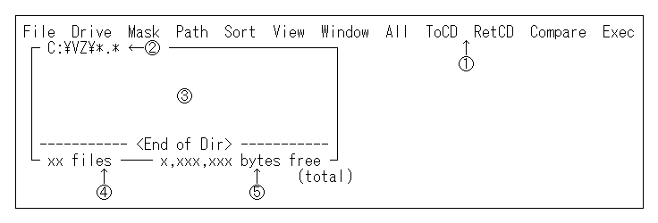

① メニューコマンド（先頭の英字キーでコマンドを実行します） 
② ディレクトリ名（カレントディレクトリの場合はリバース表示） 
③ ディレクトリの内容 
④ 表示しているファイルの総数 &emsp;ファイルを選択している場合は、選択したファイルの総数 
⑤ ディスクの空き領域サイズ &emsp;ファイルを選択している場合は、選択したファイルが消費するクラスタサイズの合計 
- 1ディレクトリ表示の場合 ･･････ ソースドライブのクラスタ単位
- 2ディレクトリ表示の場合 ･･････ ターゲットドライブのクラスタ単位

※ ④、⑤は、選択したファイルがない時とある時で表示する内容が変ります 

&emsp;ファイラー上では、次のコマンドキーでカーソルの移動、ファイルの選択、ディレクトリの移動が行なえます。
### ■ ファイラーのカーソル移動
|キー|機能|
|---|---|
|[↑]/[↓]|上下へカーソル移動|
|[←]/[→]|左右へカーソル移動（ショートモード）|
|[←]/[→]|ウィンドウ間の移動（ロング・2画面モード）|
|[**TAB**]|ウィンドウ間の移動（2画面モード）|
|[**Space**]|カーソル位置のファイルを選択･非選択|
|[**Shift**]+[↓]/[→]|選択･非選択してカーソル移動|
|[**Shift**]+[↑]/[←]|カーソル移動後、選択･非選択|
|[**PgUp**]/[**PgDn**]|1画面分移動|
|[**Shift**]+[**PgUp**]/[**PgDn**]|1行スクロール|
|[**Ctrl**]+[**PgUp**]/[**PgDn**]|ディレクトリの先頭/最後へ|
|[¥],[/]|ルートディレクトリへ移動|
|[**BS**]|親ディレクトリへ移動|
|⏎ [**Shift**]+⏎|ファイルを選択／ディレクトリ移動|
|[**ESC**]|ファイラーを中断|

※ [**PgUp**],[**PgDn**]は、98版では[**RLDN**],[**DLUP**] 

- ファイルを選択せずに⏎を押すと、カーソル位置のファイルをオープンします。
- 「.com .exe .lzh」等の拡張子のファイルの上で⏎を押すと、拡張子によるコマンドの自動実行機能が働きます。

## ５.２ メニューコマンド

&emsp;画面の一番上に表示されたメニューの先頭の英字キーを入力すると、メニューコマンドが実行できます。各メニューについて説明していきましょう。

●Ver1.6では、[←][→]キーで各メニューを移動できます。 

### ■ File
&emsp;Ver1.6で追加されたメニューです。従来のExecメニューからファイル操作関連のコマンドを集めました。各メニューについては、次節で説明します。

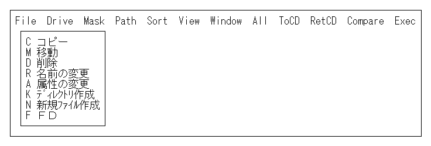

### ■ Drive
&emsp;ドライブを切り替えます。[**D**]の代わりに[**L**]または[:]キーも使えます。また、数字キーで直接ドライブを切り替えることもできます。[**0**]キーはカレントドライブに戻ります。

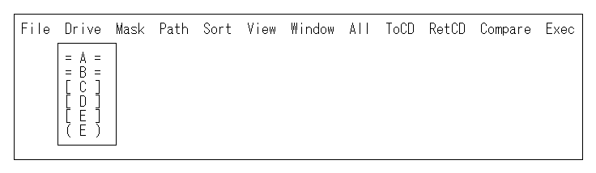

● Ver1.6では、ドライブの種類を3通りの記号で表示します。 

	 = A =		FDD、MO等の交換可能なドライブ
	［ C ］		HDD等の交換できないドライブ
	 ( E )		RAMディスク、仮想ドライブ、ネットワークドライブ等

### ■ Mask
&emsp;表示するファイルの拡張子を選択します。メニューは「VZFL.DEF」で定義してありますので、自由に設定できます。「5.4 ファイラーのカスタマイズ」を参照してください。

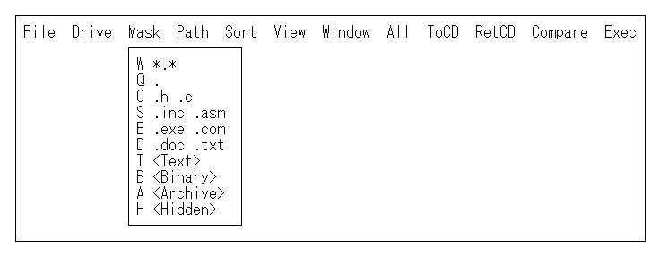

●[**＊**]キーを押すと、ファイルマスクを「＊.＊」に戻し、全ファイルを表示します。 
●Ver1.6では、拡張子の選択だけでなく、以下の属性で表示するファイルを選択できます。 

	T <Text>    	テキストファイルのみ表示
	B <Binary>  	バイナリファイルのみ表示
	A <Archive> 	アーカイブ属性のファイルのみ表示
	H <Hidden>  	隠しファイルも表示

&emsp;テキストファイルかバイナリファイルかの決定は、「3.3 ファイル名の省略」で説明したDEFファイルの設定を参照します。

●Ver1.6では、Maskメニューに、拡張子の代わりにディレクトリを記述することもできます。 

### ■ Path
&emsp;ディレクトリ、拡張子、ワイルドカードを入力して、ディレクトリ表示を切り替えます。[**P**]を押すと、次のウィンドウが開きます。

&emsp;次のようなパス・マスク指定ができます。

［例］

	b:			ドライブBの全ファイル
	*.def		拡張子 .def のファイル
	.def		*.def と同じ
	.inc .asm	拡張子 .inc または .asm のファイル
	c:¥h¥		c:¥h¥ の全ファイル
	c:¥h		c:¥h¥と同様

●⏎だけを押すと、環境変数「VZPATH」に設定されているパスのメニューに切り替わります。このメニューは、[@]キーで直接表示できます。 

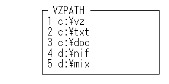

### ■ Sort
&emsp;ファイルを指定する順序で並べかえて表示します。

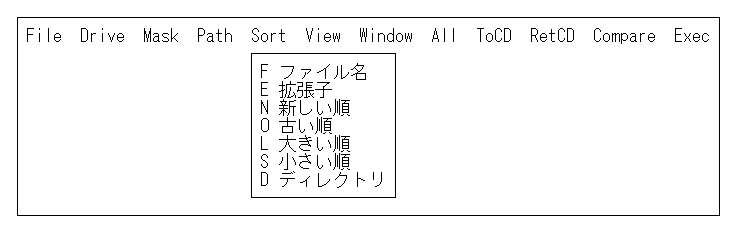

●ファイルをソートして表示すると、サブディレクトリは必ず先頭に集まります。 
●オプション***FS***を設定すれば、最初からソートして表示します。 

	FS0		ディレクトリソートオプション

	1	ファイル名
	2	拡張子
	4	新しい順
	8	古い順
	16	大きい順
	32	小さい順
	64	ディレクトリ
	
※ 複数のソートオプションを同時に指定することはできません。 

### ■ View
&emsp;ディレクトリの表示をショート形式に切り替えます。もう一度実行すると、ロング形式に戻ります。

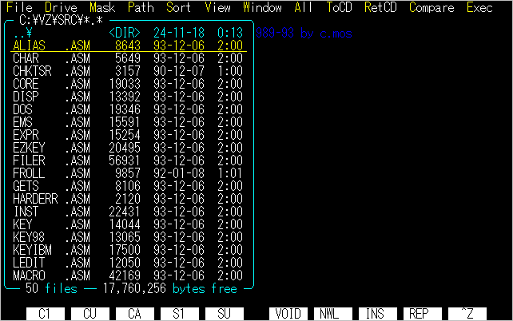

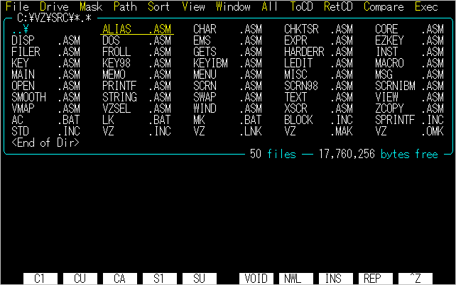

### ■ Window
&emsp;2つ目のディレクトリを開きます。ファイルをコピーする場合や、Compareメニューで2つのディレクトリを比較する時に便利です。

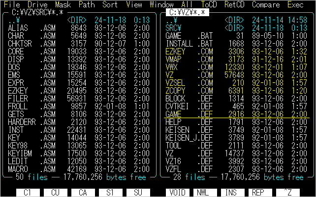

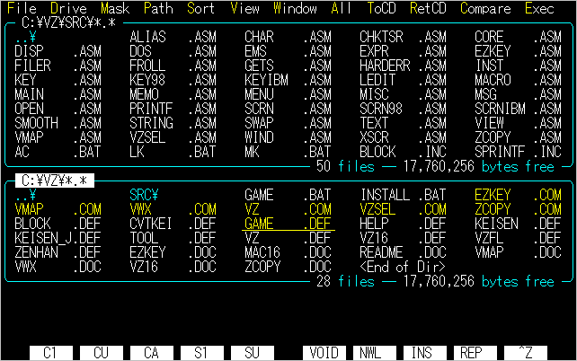

### ■ All
&emsp;全てのファイルの選択／非選択を反転します。[**A**]の代わりに[**INS**]キーも使えます。すべての選択を取り消したい時は、[**DEL**]を押してください。

### ■ TrCD
&emsp;「Transfer Current Directory」の略です。カレント・ディレクトリを、現在表示しているディレクトリへ移します。もう一度[**T**]を押すと、元のカレント・ディレクトリへ戻ります。 　カレント･ディレクトリは、ウィンドウの左上のパスが反転表示されます。

### ■ RetCD
&emsp;「Return to Current Directory」の略です。カレント・ディレクトリへ戻ります。もう一度[**R**]を押すと、元のディレクトリへ戻ります。

### ■ Compare
&emsp;2つのディレクトリのファイルを指定のオプションで比較し、条件にかなったファイルを選択します。

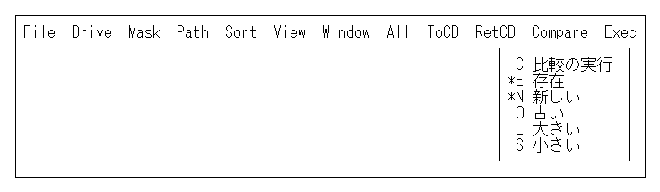

&emsp;2番目以降のメニューで比較条件を設定し、『C 比較の実行』で比較を行ないます。
標準設定では、『E 存在』と『N 新しい』の2つのオプションが選択されており、この場合は、
- ソースディレクトリのみに存在するファイル
- ソースディレクトリの方が日付が新しいファイル

を選択します。

### ■ Exec
&emsp;MS-DOSコマンドを実行するメニューを表示します。各メニューについては、次節で説明します。

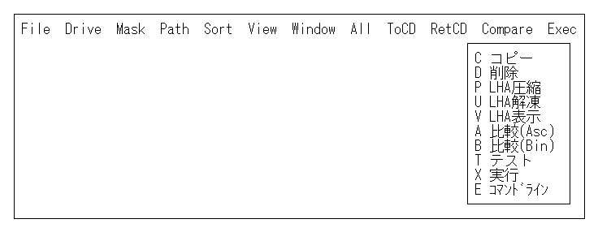

- Ver1.6では、オプション***FM***で「+***2***」を設定しておくと、ファイルを選択しなくてもExecメニューを表示します。コマンドラインへ以降する場合は、Execメニューで、もう一度[**E**]を押してください。いっぽう、Fileメニューは***FM***の設定によらず常に表示します。

## ５.３ ファイルの管理

&emsp;ここでは、VZのファイラーで、コピー、削除等のファイル管理を行なう方法について説明します。 　ファイル管理のコマンドは、FileまたはExecメニューで実行します。Execメニューは従来からありますが、FileメニューはVer1.6で新設されました。

&emsp;両方のメニューを比べてみましょう。

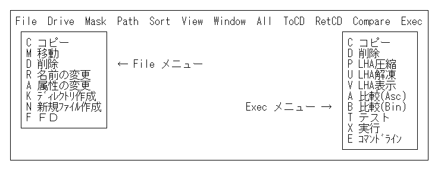

&emsp;『コピー』と『削除』は、どちらのメニューにもありますね。何が違うのでしょう。 　Execメニューの『コピー』と『削除』は、従来どおりMS-DOSの「COPY」と「DEL」を何度も呼び出します。しかし、Fileメニューの『コピー』は、選択したファイルをレスポンスファイルを介して「ZCOPY」に渡し、一度にコピーします。また、Fileメニューの『削除』は、VZのファイラーでファイルを削除します。

&emsp;それでは、各々のメニューについて説明します。

### ■ C コピー （File）
&emsp;「ZCOPY」でファイルをコピーします。 　ファイルを選択しないでメニューを実行すると、次のウィンドウを開きます。

「readme.doc」はカーソル位置のファイル名です。カーソルはファイル名の後ろにありますから、ここでコピー先のディレクトリを入力します。

⏎を押すとコマンドラインに切り替わり、「ZCOPY」を実行します。[**Shift**]+⏎でファイラーにもどってください。

&emsp;今度は、[**W**]で2つの目のディレクトリを表示し、コピー先のディレクトリに切り替えます。そしてコピー元のディレクトリへ戻り、複数のファイルを選択してください。[**F**][**C**]と押すと、先ほどのウィンドウが開き、次のようなコマンドを表示します。

&emsp;「@I:¥FILES.$$$」が「レスポンスファイル」と呼ばれるファイルです。このファイルへ選択したファイル名のリストを出力し、ZCOPYに受け渡すわけです。 　コピー先のディレクトリも「c:¥doc」とすでに表示されていますから、あとは⏎を押すだけでコピーを実行します。

&emsp;サブディレクトリを選択した場合は、「ZCOPY」の「/s」オプションにより、サブディレクトリ以下の全てのファイルをディレクトリごとコピーします。

### ■ M 移動
&emsp;「ZCOPY」の「/m」オプションを使って、ファイルを移動します。同じディレクトリの場合は、ディレクトリのエントリを変更するだけで、コピーは行ないません。異なるドライブへ移動する場合は、コピーしたあとで、元のファイルを削除します。

### ■ D 削除 （File）
&emsp;選択したファイルを削除します。メニューを実行すると、

	xx 個のファイルを削除します.よろしいですか？ (Y/N)

と表示しますので、次のキーを押してください。
|キー|機能|
|---|---|
|[**Y**],⏎|削除を実行する|
|[**N**],[**Space**],[**ESC**]|削除はしない|

削除が終了すると、ディレクトリを再表示します。

●空のサブディレクトリもこのメニューで削除できます。 

### ■ R 名前の変更
&emsp;ファイルまたはディレクトリの名前を変更します。メニューを実行すると、ウィンドウを開き、カーソル位置のファイル名を表示します。編集して⏎すれば、名前を変えられます。

●ファイラー上で直接[**R**]を押しても、この機能を実行できます。 

### ■ A 属性の変更
&emsp;ファイルの属性を変更します。変更したいファイルを選択してメニューを実行すると、次のウィンドウを開きます。

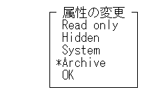

&emsp;選択した先頭のファイル（選択ファイルがなければカーソル位置のファイル）の属性が、メニューの「*」で表示されます。⏎で「＊」を切り替え、『OK』を選択すればファイルの属性を変更します。

### ■ K ディレクトリ作成
&emsp;表示中のディレクトリに、新規のサブディレクトリを作ります。メニューを実行すると、次のウィンドウを開きます。

作りたいディレクトリ名を入力して、⏎を押してください。作成されたディレクトリへカーソルを移動します。

- すでに存在するディレクトリを指定した場合は、そのディレクトリへカーソルを移動します。
- ファイラー上で直接[**K**]を押しても、この機能を実行できます。

### ■ N 新規ファイル作成
&emsp;表示中のディレクトリに、新規ファイル（サイズ0バイト）を作ります。メニューを実行すると、次のウィンドウを開きます。

作りたいファイル名を入力して、⏎を押してください。作成されたファイルへカーソルを移動しますので、必要であれば⏎で即座にオープンできます。 　すでに存在するファイルを指定した場合は、そのファイルへカーソルを移動します。ファイルの検索に利用できるわけです。（ただし、ワイルドカードは使えません）

●**ファイラー上で直接[**N**]を押しても、この機能を実行できます。** 

### ■ F FD
&emsp;フリーソフトウェアの「FD」を起動します。これは、アプリケーションを起動する例として組み込んであります。メニューを実行すると、ただちにFDが起動し、FDを終了すれば、自動的にファイラーへ戻ります。

### ■ C コピー、D 削除 （Exec）
&emsp;MS-DOSの「COPY」、「Del」コマンドを呼び出します。複数のファイルを選択した場合は、何度もコマンドを実行します。

### ■ P LHA圧縮
&emsp;選択した圧縮ファイルをフリーソフトウェアのLHAで圧縮します。ファイルを選択してメニューを実行すると、次のウィンドウを開きます。

選択したファイルの個数が3つ以下の場合は、次のようにファイル名を羅列します。

ここで、「lha a」の後ろへ圧縮ファイルを入力して、⏎を押します。

### ■ U LHA解凍

&emsp;選択した圧縮ファイルをLHAで解凍します。メニューから選択しなくても、拡張子が「.LZH」のファイルの上で[**Shift**]+⏎を押すだけで解凍できます。

### ■ V LHA表示
&emsp;選択した圧縮ファイルの内容を、LHAで表示します。このコマンドは、『DOSコマンド』ウィンドウで確認されずに、ダイレクトに実行します。メニューから選択しなくても、拡張子が「.LZH」のファイルの上で⏎を押すだけで表示できます。

### ■ A 比較（Asc），B 比較（Bin）
&emsp;MS-DOSの「FC」コマンドで、2つのディレクトリにある同名ファイルの内容を比較します。2つのディレクトリを表示してから実行すると便利です。

### ■ T テスト
&emsp;「DIR」コマンドでファイル名を表示します。正常に選択したファイル名が渡されているかどうかテストするために用意してあります。

### ■ X 実行
&emsp;カーソル位置のコマンドまたはバッチファイルを実行します。メニューを実行すると、次のウィンドウを開きます。ここで⏎を押すと、コマンドを実行します。

●**ファイラー上で直接[**X**]を押しても、この機能を実行できます。** 

### ■ E コマンドライン
&emsp;コマンドラインへ移ります。ファイラーへ戻る場合は、[**Shift**]+⏎を押してください。

●**ファイラー上で直接[**H**]を押しても、この機能を実行できます。** 

### ■ 拡張子による自動実行

&emsp;特定の拡張子のファイルの上で⏎または[**Shift**]+⏎を押すと、その拡張子に関連づけられたコマンドを、自動的に呼び出すことができます。 　「VZFL.DEF」で定義されている拡張子は、次のとおりです。

|拡張子|⏎|	[**Shift**]+⏎|
|---|---|---|
|.COM|コマンド実行|オープン|
|.EXE|コマンド実行|オープン|
|.BAT|オープン|コマンド実行|
|.LZH|リスト表示|圧縮解凍|
|.BDF|リスト表示|差分解凍|

## ５.４ ファイラーのカスタマイズ

&emsp;ファイラーの諸機能は、「VZFL.DEF」設定されています。ここでは「VZFL.DEF」を編集して、メニュー等をカスタマイズする方法について説明します。

- 従来は「VZ.DEF」の中でファイラーの機能も定義していましたが、ファイラーの機能強化より設定項目が増えたため、「VZFL.DEF」に分割しました。
- これまで使っていた「VZ.DEF」に「VZFL.DEF」をインクルードするだけで、ファイラーの新機能が使えるようになります。ただし、システムメニューの設定が重複している場合は、「VZ.DEF」のメニューの方が有効になってしまいます。この場合は、「VZ.DEF」の設定を削除してください。
- 一般的なDEFファイルの構造、書式については、第７章で説明します。

### ■ Maskメニュー
&emsp;「* S システムメニュー」の5番で、Maskメニューを設定します。

	5	"",13,10
	 	"W ＊.＊"
	 	"Q ."
	 	"C .h .c"
	 	"S .inc .asm"
	 	"E .exe .com"
	 	"D .doc .txt"
	 	"T <Text>"
	 	"B <Binary>"
	 	"A <Archive>"
	 	"H <Hidden>"

- 先頭の英字の後にスペースに続いて、ファイルマスクを書きます。マスクの代わりに、次のようにディレクトリを書くこともできます。

	    "L d:¥log¥"

- 下の4つのメニューの英字キーは、変更できません。また、不要なメニュー（たとえば"A ＜Archive＞"）は削除しても構いません。
- メニューの個数が変わったら、必ず先頭の行の左から2番目の数字（10）を、メニューの個数に変えてください。
- Maskメニューの最大数は16です。

### ■ Exec、Fileメニュー
&emsp;「* S システムメニュー」の8番でExecメニューを、13番でFileメニューを設定します。

	8	"",13,10
	 	"C コピー	copy %1 %2"
	 	"D 削除		del "
	 	"P LHA圧縮	lha a %2 %@3"
	 	"U LHA解凍	lha x "
	 	"V LHA表示	%!lha l "
	 	"A 比較(Asc)	fca %1 %2"
	 	"B 比較(Bin)	fcb %1 %2"
	 	"T テスト	dir "
	 	"X 実行		%1 %2"
	 	"E ｺﾏﾝﾄﾞﾗｲﾝ",	#H

	13	"",15,8
	 	"C コピー	zcopy /s %@1 %2"
	 	"M 移動		zcopy /s /m %@1 %2"
	 	"D 削除"	,#D
	 	"R 名前の変更"	,#R
	 	"A 属性の変更"	,#A
	 	"K ﾃﾞｨﾚｸﾄﾘ作成"	,#K
	 	"N 新規ﾌｧｲﾙ作成",#N
	 	"F FD		%!%^FD"

- メニューのタイトルと実行するコマンドの間は、1つ以上のTABで区切ります。

- コマンドの代わりに「#<英字>」を指定すると、VZの内部機能を実行します。

- コマンド中で、ファイラーで選択したファイル名、ディレクトリ名を受け取るための、次のオプションが用意されています。

|オプション|説明|
|---|---|
|%1|ソースディレクトリで選択した各ファイル名。カレントディレクトリ以外の場合は、ディレクトリを頭に付ける|
|%2|ターゲットディレクトリのディレクトリ名。ファイルが選択されている場合には、そのファイル名を付ける|
|%*|ソースディレクトリで選択した全てのファイル名の並び。|
|%!|『DOSコマンド:』ウィンドウを表示せず、ただちに実行する。|
|%^|DOSコマンド終了後、ただちにファイラーへ戻ります。|
|%@[**n**][**file**]|X選択したファイル名を、レスポンスファイル「file」に出力する。[**file**]が省略された場合は、TMPディレクトリの「FILES.$$$」に出力する。[**n**]指定時、選択したファイルがn個以下の場合は、「%*」と同様にファイル名を並べる。|

※「%! %^ %@」はVer1.6で追加されたオプションです。 

●『"D 削除 del "』のように、「%1」が省略され、コマンドの末尾がスペースの場合は、「%1」を追加して処理します。『F FD』のように、スペースがない場合は追加しません。 

### ■ 拡張子による自動実行メニュー
&emsp;「* S システムメニュー」9番で拡張子にって自動的によばれるコマンドを設定します。

	9	"",0,7
	 	"com"
	 	"exe"
	 	"BAT"
	 	"lzh %!lha l "
	 	"LZH lha x "
	 	"bdf %!bupdate -v "
	 	"BDF %!bupdate -o "

- 拡張子のあとにスペースに続いて、実行するコマンドを記述します。コマンドがない場合は、選択したファイルをそのままコマンドとみなします。
- 英小文字の拡張子は⏎で、大文字で拡張子は[**Shift**]+⏎で起動されます。

### ■ ファイラーメニューバー
&emsp;「* E その他」の4番でメニューバーのタイトルを設定し、「1 "!Filer"」マクロの

	  (r)>?{ #F #L #M #P #S #V #W #+ #> #< #O #E }

この部分で、各メニューで実行するコマンドを設定します。「#<文字>」コマンドの各機能は、「Drive」以降に並べてあります。

### ■ ファイル属性によるカラー表示
&emsp;「* E その他」の13番で、ファイル属性に応じた表示色を16進数で指定します。「00」を指定した場合は、通常のウィンドウ文字色***Aw***となります。

	* E その他

	13	"$(03,01,04,05,06,07)"
	 	   │  │  │  │  │  └── Normal
	 	   │  │  │  │  └── Binary
	 	   │  │  │  └── Directory
	 	   │  │  └── Read only
	 	   │  └── Hidden
	 	   └── System

- バイナリ属性はのファイルは、「* E その他」の9番で指定した「デフォルトバイナリ拡張子」のファイルです。

### ■ ファイラーの動作モード指定
&emsp;次のオプションで、ファイラーの4つの動作を選択します。

	FM7		ファイラーの動作モード指定
	 	+1	：[**Space**]キーでカーソルを移動
	 	+2	：ファイル非選択時にもExecメニューを表示
	 	+4	：『DOSコマンド』ウィンドウから実行
	 	+8	：ディレクトリの先頭・最後を連続移動

