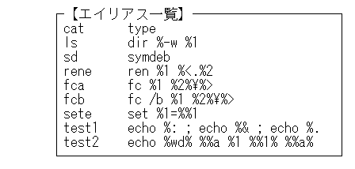
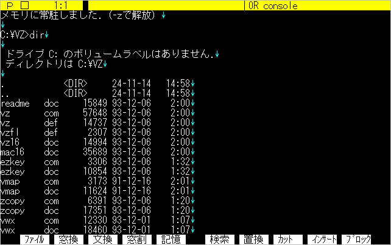

# 第６章 DOSコマンドの実行

## ６.１ コマンドラインモード

&emsp;編集時に、ファイルメニューで『E DOSコマンド実行』を選択するか、[**ESC**][**E**]を押すと、DOS画面を表示し、コマンドラインモードになります。
### ■ DOSコマンド実行
|キー|機能|
|---|---|
|[**ESC**][**E**]|DOSコマンド実行|

&emsp;非常駐モードでは、最下行に黄色いプロンプトを表示します。

	A:¥>

常駐時は、通常のDOSプロンプトです。ただし、アプリケーションからVZを起動している場合は、非常駐時と同様に黄色いプロンプトになります。

&emsp;コマンドラインモードでは、次の種々の機能を利用して、DOSコマンドを実行することができます。 　・行編集・ヒストリー機能
&emsp;・エイリアス機能
&emsp;・マルチステートメント機能
&emsp;・環境変数の参照
&emsp;・選択ファイルに対するコマンドの連続実行

&emsp;行編集・ヒストリー機能については、2章、4章で説明しましたが、コマンドラインモードではその他にも次のようなコマンドが使えます。
### ■ コマンドラインモード
|キー|機能|
|---|---|
|[**ESC**]|エスケープ|
|⏎|リターン|
|[**Shift**]+⏎|ファイラー起動|
|[**Shift**]+[**ESC**]|DOS画面出力の参照|
|[**Ctrl**]+[**W**]|エイリアス一覧|
|[**Ctrl**]+⏎|コマンドの展開再表示|

### ■ エスケープ [**ESC**]
&emsp;編集モードへ戻ります。この時のDOS画面は保存され、次回コマンドラインモードに移る際に、再び表示します。
### ■ リターン ⏎
&emsp;入力したDOSコマンドを実行します。実行が終了すると、コマンドラインモードに戻ります。

●非常駐時の黄色いプロンプトでは、⏎のみ押すと「COMMAND.COM」を呼び出します。画面には、 

	EXITでエディタへ戻ります
	Command ﾊﾞ-ｼﾞｮﾝ 5.00A
	C:¥VZ>

というようなメッセージが出て COMMAND.COM に制御が渡ったことを示します。この状態ではVZの管理を離れますので、コマンドラインの種々機能を使うことはできません。再びVZに戻るときは、

	C:¥VZ>exit⏎

を実行してください。COMMAND.COM を指定パスからロードできない場合、または実行するメモリが不足している場合は、

	COMMAND.COMを起動できません
と表示し、ただちに編集モードに戻ります。

### ■ ファイラー起動 [**Shift**]+⏎
&emsp;ファイラーを起動します。[**Shift**]+⏎の前に文字列を入力すると、いろいろな動作をしますが、これについては「6.4ファイラーとの連携」で説明します。
### ■ DOS画面出力の参照 [**SHIFT**]+[**ESC**]
&emsp;コンソール画面を表示します。この機能については「6.5コンソール出力の参照」で説明します。
### ■ エイリアス一覧 [**Ctrl**]+[**W**]
&emsp;エイリアスの定義の一覧を表示します。エイリアスについては「6.3エイリアス」で説明します。
### ■ コマンドの展開再表示 [**Ctrl**]+⏎
&emsp;入力したDOSコマンドを、エイリアス・環境変数で展開してコマンドラインに再表示します。実行はしません。このコマンドで、エイリアスや環境変数がどのように展開されるかを事前に知ることができます。

## ６.２ コマンドラインの拡張機能

&emsp;コマンドラインモードでDOSのコマンドを入力する場合には、次の拡張機能が利用できます。
### ■ エイリアス機能
&emsp;DOSコマンドを短縮した別の名前で入力する機能です。次節で詳しく述べます。
［例］

	A:¥>ls[**CR**]
	→  dir /w
### ■ マルチステートメント
&emsp;複数のコマンドを、「<ｽﾍﾟｰｽ>;」で区切って、一行に記述できます。⏎で指定したコマンドを順次実行します。
［例］

	A:¥>del ¥tmp ;rd ¥tmp[**CR**]
	→  del ¥tmp
	    rd  ¥tmp

- コマンドの実行を中断する時は、[**STOP**]または[**Ctrl**]+[**Break**]キーを押してください。[**Ctrl**]+[**C**]では、その時実行しているコマンドは中断しますが、マルチステートメントやエイリアスの実行を中断することはできません。
### ■ 環境変数の参照
&emsp;バッチファイルと同様に、「%...%」で環境変数を参照できます。
［例］

	A:¥>optasm %opt%[**CR**]
	→　optasm /ml

&emsp;以上をまとめると、入力したコマンドは、次の順序で展開し、実行します。

［エイリアス展開］→［環境変数展開］→［再表示］→［各コマンドの実行］ 
&emsp;　　　　　　　　　　　　　↑ 
&emsp;　　　　　　　　[**Ctrl**]+⏎の場合は、ここで中断

●オプション***Sd***を「***-***」に指定すると、再表示しないで実行することができます。 

	Sd+	DOSコマンドラインの展開再表示

## ６.３ エイリアス機能

&emsp;エイリアス（別名）機能は、コマンドを別の短い名前で定義しておき、より少ないキーストロークで実行する機能です。エイリアスは、DEFファイルの

	* A エイリアス

の箇所で定義します。どのようなエイリアスが定義されているか知りたい場合は、[**Ctrl**]+[**W**]を実行してください。

&emsp;エイリアス定義の書式は、次のとおりです。

［書式］

	<エイリアス名> <コマンド>

［例］

	cat	type
	ls	dir %-w %1

&emsp;最初の例のように単にコマンド名を置き換えることもできます。また、2番目の例のように、引数を参照したり、マルチステートメントを利用して、複数のコマンドを実行させることもできます。ただし、1行内で記述しなくてはなりません。

&emsp;バッチファイルでは、バッチファイルを起動したパラメータを「%1～%9」で参照することができますが、VZのエイリアス機能では、もう少し複雑な参照が可能です。
### ■ エイリアスのパラメータ
|記号|説明|
|---|---|
|%1～%9|1～9番目のパラメータ|
|%*|全パラメータ|
|%*n|n 番目以降の全パラメータ|
|%:|パス名|
|%&|ファイル名|
|%.|拡張子|
|%<|パス名＋ファイル名|
|%>|ファイル名＋拡張子|
|%:n|n 番目のパラメータのパス名|
|%¥|直前の文字が¥で無い場合にのみ¥を付加|
|%-|スイッチキャラクタ（/,-）|
|%%|% 文字|

&emsp;例えば引数が「a:¥path¥file.ext」の場合、

	%:		a:¥path¥
	%&		file
	%.		ext
	%<		a:¥path¥file
	%>		file.ext

というように、パスの一部を参照することができます。

［例］

	（Alias定義）rene ren %1 %<.%2

	A:¥>rene test.asm bak[**CTRL**]+[**CR**]
	→  ren test.asm test.bak

●エイリアスは1度しか展開されません。従ってコマンドの記述の中に、他で定義されたエイリアスを記述しても、それは展開されません。このため、次の例のような重複定義が可能となっています。 
［例］

	（Alias定義）dir dir %-w %1

●実行中にエイリアスを再定義する機能はありません。 

## ６.４ ファイラーとの連係

&emsp;コマンドラインから[**Shift**]+⏎でファイラーを起動することができるのは、前にも触れました。この時、次のように[**Shift**]+⏎の前に、表示したいディレクトリのパスおよびマスクを入力することで、ただちにそのディレクトリを開くことができます。

［例］

	C:¥VZ>a:[**Shift**]+⏎
	C:¥VZ>c:¥doc[**Shift**]+⏎
	C:¥VZ>.def[**Shift**]+⏎

&emsp;さらに、コマンド名の後ろにスペースを入れてから[**Shift**]+⏎でファイラーを起動すると、⏎で選択したファイル名に対して、コマンドを連続実行することができます。

［例］

	C:¥VZ>copy [**Shift**]+⏎　（"copy"の後にスペースを入れます）

&emsp;・ファイラー上で、例えば「README.DOC」へカーソルを移動して⏎
	C:¥VZ>copy readme.doc

このように、入力文字列の中にスペースが含まれる場合は、コマンドとみなすわけです。　次のような記述もできます。

［例］

	C:¥VZ>copy a:¥[**Shift**]+⏎

&emsp;・「a:¥」のディレクトリを表示します。 　・複数ファイル、例えば「VZ.COM, VZ.DEF」を選択して⏎

	C:¥VZ>copy a:¥%?

ここで⏎を押すと、複数ファイルのコピーが実行されます。行末からスペースまでをパス・マスクとみなすわけです。

## ６.５ コンソール出力の参照

&emsp;VZでは、編集テキスト以外に「コンソールファイル」と呼ばれる、DOSの画面出力を取り込むためのファイルを、別途オープンしています。コンソールファイルは、次のコマンドで参照できます。

■ コンソール出力の参照 
|キー|機能|
|---|---|
|[**Shift**]+[**ESC**]|DOS画面出力の参照|

&emsp;コンソールファイルは、ステータス・ラインが黄色で（PC-9801版）、ファイル名は「console」となります。再度[**Shift**]+[**ESC**]を実行すると、コンソールファイルはクローズしますが、その内容は保存されます。 　エディタを起動した直後は、コンソールファイルには何も入っていません。[**ESC**][**E**] コマンドを実行して、コマンドラインモードからDOSコマンドを実行すると、その画面出力がコンソールファイルに書き出されていきます。
### ■ コンソールバッファ
&emsp;コンソールファイルは、他のテキストと全く同様に扱うことができます。ただし、バッファのサイズは最大時32KBで、それ以上は大きくはなりません。一杯になった場合には、先頭から1/4づつ切り詰められます。サイズはオプション***Bo***で設定します。

	 Bo32		コンソール出力取込みバッファサイズ

このオプションを「***0***」にすると、コンソールファイル機能は使用できなくなります。

&emsp;コンソールバッファは、EMS上に確保されます。EMSのない機種ではメインメモリ上に取られますので、使用メモリが膨れ上がって、DOSコマンドを正常に実行できなくなります。
### ■ コンソールファイルの使い方
&emsp;コンソールファイルは、次のような時に利用できます。
	・dir等のコマンドの出力をテキスト中に貼り込みたい
	・コンパイルエラーからタグジャンプしたい
これらの機能は従来、いったんエラーメッセージをファイルにリダイレクトしてから、エディタで読み込み、参照していましたが、VZのコンソールファイル機能を利用すれば、その必要はありません。
### ■ コンソールファイルの取り込みの停止
&emsp;オプション***Sx***を「***-***」に指定すると、一時的に画面出力の取り込みを停止します。

	Sx-		コンソール出力の取込み
### ■ 特殊なコードの取り込み
&emsp;画面出力のうち「エスケープシーケンスコード（1Bhに続く種々の画面制御を行なうコード列」は、コンソールファイルには取り込まれません。これは、DOSのプロンプトを

	A>prompt $e[22m$p$e[m$g

というように設定している場合、プロンプトを表示するたびにエスケープシーケンスコードをコンソールファイルに出力し、たいへん見苦しいためです。しかし、オプション***Se***を「***-***」に指定することで、エスケープシーケンスコードも取り込みよう指定できます。

	Se+		エスケープシーケンスのスキップ

## ６.６ 常駐とスワップ

&emsp;アプリケーションからDOSコマンドを呼び出す場合、アプリケーションがメモリをたくさん使っていると、メモリ不足でコマンドが実行できないことがあります。このような場合、アプリケーションが自分自身をいったんテンポラリファイルやEMSへ追い出し、メモリを解放してからDOSコマンドを呼び出せば大丈夫です。これが「スワップ機能」です。もちろん、VZもこの機能をもっています。

&emsp;VZのスワップ機能は、オプション「SW」で指定します。各モードによって、解放するメモリエリアが異なります。

	SW3		スワップモード
	 	0	：スワップ機能を使用しない
	 	1 	：テキスト領域のみ解放する
	 	2 	：コード領域も含めて解放する
	 	3	：常駐時に常にコード領域まで解放する
	 	4	：「SW3」と同様だが、アプリケーションのコマンドラインはフックしない

※ ***SW4***はVer1.6で新設。後述の「常駐に関する制限事項」参照。 

&emsp;第1章で説明したように、VZはメモリに常駐することができます。しかし、VZの動作時の必要メモリは、少なくありません。このため***SW3***指定時は、DOSコマンドを実行する度に自動的にスワップアウトします。

### ■ 強制スワップ指定
&emsp;テキストを編集中に[**ESC**][**E**]（Exec）でコマンドラインからDOSコマンドを実行する場合は、通常、スワップアウトはしません。これは、編集テキストによってスワップアウトすべきメモリサイズが大きくなり、タイムロスを生じる可能性があるからです。 　この場合は、次の方法で明示的にスワップアウトを指定します。

	実行するコマンドの先頭文字を大文字で指定する

［例］

	C:¥VZ>vz -sw3 -z
	（テキストをオープンし、[ESC][E]でコマンドラインへ）

	C:¥VZ>vmap
	VMAP Version 2.01  Copyright (C) 1989-91 by c.mos

	addr PSP  blks   size  owner/parameters           hooked vectors
	---- ---- ---- ------  -------------------------  --------------
	...
	1F4D <--    2  211952  vz 1.59g -sw3 -z           06 21 29 30
	530E-A000   1  315152  <free>

	C:¥VZ>Vmap
	VMAP Version 2.01  Copyright (C) 1989-91 by c.mos

	addr PSP  blks   size  owner/parameters           hooked vectors
	---- ---- ---- ------  -------------------------  --------------
	...
	1F4D <--    1    3808  vz 1.59g -z @@             06 21 29
	203C-A000   1  523312  <free>

&emsp;コンパイラ等、スワップアウトしないと動作しなコマンドは、次のようにエイリアスに登録しておくとよいでしょう。
［例］

	* A エイリアス
	tc Tc

- 非常駐時に、コマンドラインで⏎のみ入力して「COMMAND.COM」を呼び出した場合は、必ずスワップを実行します。

### ■ 他のアプリケーション上で
&emsp;VZ常駐時に、FD等のアプリケーションから常駐したVZを呼び出すと、[**ESC**][**E**]でアプリケーションに戻ってしまいました。この後、メモリ上にはVZが残っているため、動作が不安定になります。Ver1.6ではこの不具合を修正し、アプリケーション上では、[**ESC**][**E**]で非常駐時の黄色いプロンプトとなり、コマンドを実行できるようにしました。 　ただし、VZがコマンドラインから実行されたか、アプリケーションから呼び出されたかを判断するのはかなり困難です。現在のバージョンでは、呼び出し元の「COMMAND.COM」と、常駐したVZとのメモリ上の配置によって判定しています。このため、フリーソフトウェア等で「COMMAND.COM」をUMBへ移動していると判定を誤り、コマンドラインから「VZ⏎」で起動しても、[**ESC**][**E**]で黄色いプロンプトが現れてしまいます。この場合は、「COMMAND.COM」をUMBに移動するのはやめてください。

### ■ 常駐に関する制限事項

- 複数の常駐ソフトを組み込む場合、原則的にVZは最後に常駐してください。特に、日本語FEPを「ADDDRV」で組み込む場合は、必ずVZの前で組み込んでください。さもないと、VZがFEPを認識できず、自動制御が効かない場合があります。

- しかしVZを常駐したあとに、他の常駐ソフトを組み込むことも、できなくはありません。しかしトラブルのもとになる場合が多々あります。

- 編集テキストの占めるメモリは、常に連続していなければなりません。編集中に、スワップアウトせずに他の常駐ソフトを実行すると、VZの編集テキストの上位に、常駐ソフトが居座ってしまいます。こうなると、VZはその時使っていたメモリだけしか使えなくなります。従って、VZの後から常駐ソフトを組み込む場合は、編集テキストを全て閉じるか、スワップアウトを明示的に指定してください。

- ***SW3***で常駐時に「SYMDEB」を実行すると、SYMDEBの管理するフリーエリア内に、VZがロードされてしまいます。（メモリをダンプすればわかります）これを防ぐために、Ver1.6でアプリケーションのコマンドラインはフックしないモード***SW4***を新設しました。

