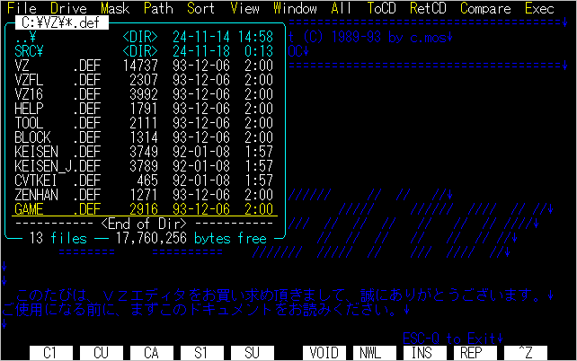
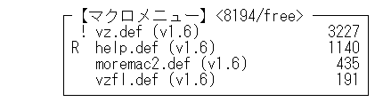
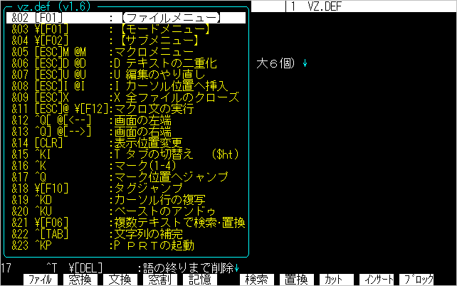
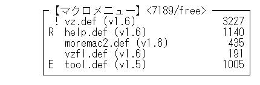
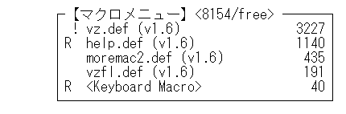

# 第８章 マクロの使い方

## ８.１ マクロ導入編

&emsp;VZは、シンプルながらも強力なマクロ言語を装備しています。VZの標準コマンドの中にも、マクロで書かれているものがあります。また、書籍やパソコン通信等で多数マクロライブラリが発表されており、これを組み込むことでVZの機能を大幅にパワーアップさせることができます。 　この節では、まずVZのマクロとはどんなものか、簡単に説明します。次に、マクロのコマンドをウィンドウで実行する「マクロ文の実行機能」についても説明します。

### ■ マクロとは
&emsp;ひとくちに「マクロ」といっても、アプリケーションの種類によって様々な意味をもちます。エディタの場合は、普通次のどちらかの機能を指します。
- 一連のキー操作を1つのキーに記憶し、ワンタッチで実行させる機能 
&emsp;　　　→　キーボードマクロ 
- マクロ言語を用いて、コマンドをプログラミングできる機能 
&emsp;　　　→　プログラマブルマクロ 

&emsp;VZではどちらの機能もサポートしています。キーボードマクロについては、次節で説明します。

### ■ マクロはどうやって起動するのか
&emsp;VZが、DEFファイルと呼ばれる定義ファイルによって、環境を作りあげていることは前の章で説明しました。マクロは、全てこのDEFファイルの中に書かれています。起動時にDEFファイルを読み込むと、マクロは「マクロバッファ」と呼ばれる内部ワークエリアに、ほぼそのままの形で格納されます。 　コマンドキーが押されると、VZはまず基本コマンドとして定義されていないか探します。もしなければ、「マクロバッファ」に格納されているマクロを順番にサーチし、見つかればそのマクロを実行します。ユーザーは、コマンドがマクロで実現されているかどうかを意識する必要はありません。

&emsp;また、Ver1.6では、外部マクロファイルの自動ロード機能を内蔵しました。たとえば「全角／半角変換」を実行したいとします。あらかじめインストールしていない場合、従来は[**ESC**]+[**^**]の「外部マクロの実行」機能で「ZENHAN.DEF」を読み込み必要がありました。Ver1.6では、ただ[**Ctrl**]+[**K**][**Z**]と打つだけで、マクロバッファに「ZENHAN.DEF」がなければ読み込み、実行してくれます。

- Ver1.6では、「イベントマクロ」と呼ばれる、特定のイベントで自動的に起動されるマクロも新設されました。これについては「8.5 イベントマクロ」で説明します。

### ■ VZのマクロはどんな言語か
&emsp;DEFファイルをご覧ください。「* M マクロ」という項目に、記号がたくさん並んでいます。これがVZのマクロ言語です。一見すると難解な暗号のようですが、実は直感的で理解しやすい言語です。昔は、BASICからプログラミングを始める人がほとんどでした。今では、VZのマクロで初めてプログラミングを経験される方もいます。逆に、素晴らしいマクロを発表されている方の多くは、プログラミングの経験がありません。決してVZのマクロ言語は、難かしくはないのです。

### ■ マクロ文の実行
&emsp;[**ESC**][@]（または[**Shift**]+[**F12**]）を押してみてください。次のような小さなウィンドウが開きます。

このウィンドウでマクロのコマンドを入力し、実行することができます。例えば、次のようなオプションや演算式もマクロのコマンドの1つです。

	1234+$5678   '漢'   an=ac=6   du+   ef   pi

&emsp;コマンドを実行すると、

	Result: ...

&emsp;というメッセージが現れます。演算の結果やオプションの値を、

&emsp;　　　<符号付き10進数> <符号なし10進数> <16進数> '文字' "文字列"

とみなして、表示しています。 　マクロのコマンドや演算式については、「8.6 マクロのコーディング」で詳しく説明します。ここでは、このコマンドで簡単にオプションの値を参照・変更できることだけ覚えてください。

■ マクロ文の実行 
|キー|機能|
|---|---|
|[**ESC**][@] [**Shift**]+[**F12**]|マクロ文の実行|

## ８.２ キーボードマクロ

&emsp;マクロ言語なんて勉強している暇はない、という方も、「キーボードマクロ機能」だけは覚えておいて損はありません。

### ■ キーボードマクロの例
&emsp;キーボードマクロとは、一連のキー操作を1つのキーに記憶し、ワンタッチで実行させる機能のことです。 　例えば、「list.txt」を「list.bat」に変換したいとしましょう。

**list.txt:**

	VZ       COM    40200  89-06-30    1:01
	VZ       DEF    11178  89-06-30    1:01
	VZ       DOC    64445  89-05-10    1:00

**list.bat:**

	copy VZ.COM b:
	copy VZ.DEF b:
	copy VZ.DOC b:

このように、同じ手順の変換を各行で行なう場合に、キーボードマクロが役立ちます。まず、最初の行の変換を次の手順で登録します。
- 「list.txt」の先頭にカーソルを移動
- [**Ctrl**]+[_]でキーボードマクロの登録を開始 （この時画面の左下に「m」が表示されます）
- "copy " [**Shift**]+[→] [**Shift**]+[**BS**] "." [**Shift**]+[→]  [**Shfit**]+[**BS**]  [**Ctrl**]+[**Del**] " b:"
- [**Ctrl**]+[←]  [↓] でカーソルを次の行の先頭へ移動
- [**Ctrl**]+[¥]でキーボードマクロを登録 （この時画面の左下に「OK!」が表示されます）

これで、一連のキー操作を、[**Ctrl**]+[¥]キーに登録しました。もう一度[**Ctrl**]+[¥]を押してください。2行目が瞬時に変換されました。後は[**Ctrl**]+[¥]を押し続ければ、いくらでも変換できます。 　このように、各行で同じ編集操作を行なう場合に、キーボードマクロを使うと大変便利です。

■ キーボードマクロ 
|キー|機能|
|---|---|
|[**Ctrl**]+[_]|キーボードマクロ登録開始|
|[**Ctrl**]+[¥]|登録する未使用キー|
|[**Ctrl**]+[**K**][_]|キーボードマクロ文挿入|

### ■ キーボードマクロの登録 [**Ctrl**]+[_]
&emsp;キーボードマクロの登録を開始します。コマンドを実行すると、ファンクションキー表示の左端に、「m」を表示して、キーボードマクロの登録中であることを示します。この後、以下のキーが入力されるまでの一連のキー操作を登録します。

&emsp;　　　[**Ctrl**]+[_]&emsp;　　　　　　：登録を中止 
&emsp;　　　[**Ctrl**]+[¥]等の未定義キー：登録 

&emsp;登録が完了すると、「OK!」と表示し、これ以降[**Ctrl**]+[¥]キーで一連の操作が実行できます。異なった未定義キーを使えば、複数のキーボードマクロを登録することもできます。また、同じキーに何回でも登録し直せます。

- キーボードマクロは、オプション「Bm」で指定したマクロバッファのフリーエリアに登録します。登録中にバッファが一杯になった場合は、自動的に登録は中止し、「m」は消されて、それまでの登録は無効になります。
- キーボードマクロの登録中に他のマクロを実行しても構いません。

&emsp;登録したキーボードマクロをセーブしておきたい場合もあります。
### ■ キーボードマクロ文挿入 [**Ctrl**]+[**K**][_]
&emsp;このコマンドを実行すると、現在までに登録した全てのキーボードマクロを、DEFファイルに記述できるマクロコードに変換して、カーソル位置に挿入します。

&emsp;先の例で登録した場合は、次のような文字列になります。

	90 ^¥ "" "copy "#f#16"."#f#16#l" b:"#<#x

これをDEFファイルの「* M マクロ」の適当なところへコピーすれば、次回からマクロコマンドとして使うことができます。もちろんその場合は、番号とキー定義を適当なものに変更する必要があります。

- キーボードマクロには、90番～99番のマクロ番号を割り当てています。すなわち、最大10種類のキーボードマクロを同時に登録できることになります。逆にマクロ番号は89番までしか使えません。

## ８.３ 外部マクロ

&emsp;マクロは「VZ.DEF」の中にたくさん定義してありますが、少し大きめのマクロ、あるいは普段は余り使わないようなマクロは、必要に応じて編集中にロード・実行することができます。このように、後から組み込むマクロファイルを、「外部マクロ」と呼びます。 　Ver1.6では、外部マクロのロード・管理機能が強化され、マクロ番号を意識せずに、複数の外部マクロを組み込むことができます。これについては、「8.4 モジュール管理」で詳しく説明します。

■ 外部マクロの実行 
|キー|機能|
|---|---|
|[**ESC**][^]|外部マクロの実行|
|[**Ctrl**]+[**K**][**M**] [**Shift**]+[**F11**] |外部マクロメニュー|

### ■ 外部マクロの実行 [**ESC**][^]
&emsp;コマンドを実行するとファイラーが起動し、VZDEFディレクトリの拡張子が「.DEF」のファイルを表示します。

ここで、実行したい外部マクロファイルのところへカーソルを移動して⏎を押せば、マクロファイルを読み込み、マクロバッファへ組み込んで実行します。

- マクロファイルの中に複数のマクロが入っている時は、最初のマクロを実行します。
- 従来版では、このコマンド実行後ファイラーを起動すると、再びVZDEFディレクトリを表示してしまいました。Ver1.6でこの不具合は改善しました。

### ■ 外部マクロメニュー [**Ctrl**]+[**K**][**M**]
&emsp;いちいちファイラーから選ぶのが面倒な場合は、よく使う外部マクロをメニューに登録することができます。[**Ctrl**]+[**K**][**M**]を押すと、次のメニューを表示します。

&emsp;先頭の『F <ファイル選択>』を選ぶと、前に述べたファイラーからの選択になります。選択したマクロがすでに読み込まれている場合は、即座にマクロを実行します。

&emsp;このメニューは、「VZ.DEF」の最後の「* O オプション」の上で設定されています。

	* P メニュー

	1	"【外部マクロ】",20,6		; ← マクロの数＋1
	　　"F <ファイル選択>"
	　　"1 各種ツール		tool"	; ← TABで区切ってファイル名
	　　"2 矩形ブロック		block"
	　　"3 罫線入力		keisen2"
	　　"4 全角/半角変換	zenhan"
	　　"5 ゲーム		game"

&emsp;メニューを追加する場合は、タイトルとファイル名を1つ以上のTABで区切ってください。またメニューの項目が増えた時は、先頭のメニューの個数も増やしておいてください。

### ■ マクロキーの後優先
&emsp;従来、マクロの中で複数のキーアサインが重複している場合は、最初に見つかったマクロを起動していました。このため、外部マクロで定義しているキーが「VZ.DEF」内のマクロですでに使われていると、外部マクロの機能が使えませんでした。Ver1.6では、後から組み込んだマクロが優先されます。

&emsp;マクロキーの後優先により、マクロの自動ロードが可能になりました。次のように、「VZ.DEF」内には、所定のマクロのロード命令のみ記述しておきます。

	1 [HELP] "ヘルプ" &z("help") >*
	1 ^KZ "全角／半角変換" &z("zenhan") >*

初めて[**Ctrl**]+[**K**][**Z**]を押すと、こちらのマクロが実行され、「ZENHAN.DEF」を呼び出します。2回目以降は、後優先によって、直接 ZENHAN.DEF 本体が実行されるわけです。

## ８.４ モジュール管理

&emsp;Ver1.6でマクロバッファの容量が大きくなったことにより、より沢山のマクロを組み込めるようになりました。しかし従来、マクロバッファ内のマクロは、「マクロ番号」でしか管理していません。このため、番号の競合によるいろいろな不具合が起こってしまいました。これを解決するのが、新たに導入した「モジュール管理」です。
### ■ モジュールメニュー
&emsp;まずは、[**ESC**][**M**]を押してみてください。次のようなメニューを表示します。これを「モジュールメニュー」と呼びます。

ここには、マクロバッファに読み込まれているモジュール名と、そのサイズが表示されています。名前の前の「!」や「R」などの記号は、後ほど説明します。

&emsp;お気付きだと思いますが、モジュール名は、読み込んだDEFファイルの先頭行から、前後の「=」を除いたものです。すなわち、DEFファイルの「=」で始まる行から、次の「=」で始まる行、またはファイルの終端までを、1つのモジュールとみなすわけです。

&emsp;⏎を押すと、そのモジュールに含まれるマクロの一覧を表示します。これが従来版では最初に表示される「マクロメニュー」です。モジュール管理により、マクロメニューが階層化されたわけです。

&emsp;マクロメニューでは次のキーが使えます。

■ マクロメニュー 
|キー|機能|
|---|---|
|[←]/[→]|前後のモジュールのメニューを表示|
|⏎|カーソル位置のマクロを実行|
|[**ESC**]|モジュールメニューへ戻る|

### ■ モジュールの追加・削除
&emsp;次に、何か外部マクロをロードしてみましょう。モジュールメニューで[**INS**]キーを押してください。[**Ctrl**]+[**K**][**M**]と同様の『外部マクロ』メニューを表示します。『各種ツール』を選択すると、「TOOL.DEF」をロード・実行し、『ツールメニュー』を表示します。これは[**ESC**]で抜け、もう一度[**ESC**][**M**]で『モジュールメニュー』を表示します。

最後に「tool.def」が追加されています。「E」は、後から読み込まれたマクロであることを表します。同じように他のマクロを読み込んでみてください。

&emsp;複数の外部マクロを読み込むと、そのうちにマクロバッファが足りなくなります。その場合は、読み込んでいる外部マクロの先頭のものから自動的に削除されます。また、[**DEL**]キーで不要なモジュールを削除することもできます。

■ モジュールメニュー 
|キー|機能|
|---|---|
|[**INS**]|外部マクロメニューへ|
|[**DEL**]|モジュールの削除|
|⏎|マクロメニューへ|

&emsp;削除できるモジュールは、「R」または「E」のマークのついたものだけです。また、「!」のついたモジュールより前のモジュールは、削除できません。「!」は、そのモジュールの中に、実行中のマクロがあることを示します。モジュールを削除すると、それより後にロードされたマクロの位置がずれますから、実行中だと誤動作してしまうのです。

	E	:後から読み込んだモジュール
	R	:削除可能なモジュール（Romovable）
	!	:実行中のモジュール

### ■ キーボードマクロ・モジュール
&emsp;キーボードマクロを登録すると、これも1つのモジュールとなります。[**Ctrl**]+[_]と[**Ctrl**]+[¥]の組み合わせで、適当にキーボードマクロを登録してください。

&emsp;キーボードマクロは、外部マクロをロードしても保存されます。不要になったら[**DEL**]で消してください。

### ■ モジュールヘッダ
&emsp;モジュール管理は、DEFファイルの「=」で始まる行を基に行ないます。この行を「モジュールヘッダ」と呼びます。モジュールヘッダの書式は、「7.2 DEFファイルの構造」で説明しました。ここではもう少し詳しく説明します。

［書式］

	============ filename.def コメント ============
	(option)

- モジュールヘッダの先頭は、必ず「=」にします。「;」をつけると、コメント行として無視されてしまいます。モジュール管理のためにはこの書式のモジュールヘッダが必要ですので、お使いのマクロファイルを確認してください。
- 「filename」はモジュール名としてマクロバッファに格納されます。モジュール名は、外部マクロをロードする際、すでにメモリに読み込まれているかどうかチェックするのに使います。
- コメントは自由に書けます。コメントが長すぎてモジュールメニューで最後まで表示できない場合は、DEFファイルの「* S システムメニュー」の10番のメニューの幅を広げると良いでしょう。

 		10	"【マクロメニュー】<$BM/free>",50,0

- モジュールヘッダの次の行の先頭が「(」（半角丸括弧）の場合は、ここに「モジュールオプション」を記述します。これについて次に説明します。

### ■ モジュールオプション
&emsp;モジュールオプションは、括弧の中の英単語で指定します。オプションの種類は、先頭の一字で決まります。次の2つのオプションが使えます。

	Removable	:削除可能
	Sleep		:起動時以外は、2番目以降のマクロのキーを無効にする

［例］

	======== help.def ========
	(R)

	======== keisen.def ========
	(Removable Sleep)

**【Removable】** 
&emsp;モジュールメニューで「R」と表示されている、削除可能なモジュールがあります。通常、起動時に組み込んだモジュール（VZ.DEF内のマクロと、インクルードしたマクロ）は、削除できません。このオプションを指定することで、削除できるようになります。ただし、マクロバッファが一杯になった時の自動削除の対象とはなりません。

**【Sleep】** 
&emsp;たとえば、[**Ctrl**]+[**矢印キー**]を使って、罫線を引くマクロがあるとします。このマクロを呼び出すと、[**Ctrl**]+[**矢印キー**]は常に罫線を引くキーとなり、通常の機能は使えなくなってしまいます。 　この問題を回避するために、そのモジュールが起動されるまでは、モジュールの2番目以降のマクロのキーを無効にする機能が、Sleepオプションです。先頭のマクロは、マクロを起動するために必要ですから、常に有効です。モジュールの実行が終わると、再び2番目以降のキーは無効になります。

## ８.５ イベントマクロ

&emsp;「イベントマクロ」は、特定のイベントが発生した時に自動的に実行されるマクロです。キーによって起動する必要はありません。組み込んでおくだけでよいのです。 　イベントマクロは、次の8種類です。

	!Start		VZ起動時に実行
	!Open		ファイルオープン時に実行
	!Close		ファイルクローズ時に実行
	!Edit		編集モードで、特定の文字キー入力時に実行
	!View		Viewモードのファイルに編集操作を行なった時に実行
	!Timer		編集モードで、一定時間キー入力がないと実行
	!Filer		ファイラーで文字キー入力時に実行
	!Abort		エラー発生時に実行

- マクロのタイトル名の先頭が「!」のマクロを、イベントマクロと認識します。イベントの種類は、続く単語の先頭1文字で決定します。
複数の同じ種類のイベントマクロを記述した場合は、最後のマクロが実行されます。
- イベントマクロについての詳しい仕様は、「MAC16.DOC」をご覧ください。

### ■ ！Start
&emsp;！Startイベントは、VZを起動し、初期化が終了した時点で実行されます。常駐時は、コマンドラインから「vz⏎」で起動したとき、およびアプリケーションの子プロセスで呼び出された時に実行されます。オプション「r」によるオート実行は、編集画面が開くまでマクロは実行しませんが、！Startイベントはその前に呼ばれます。 　！Startイベント中に「#コマンド」は記述できません。記述した場合の動作は不定です。「&#コマンド関数」は使えます。

### ■ ！Open
&emsp;！Openイベントは、ファイルオープン時に実行されます。ファイルの拡張子によるタイトルサーチ文字列、画面の横幅等の設定に用います。 　！Startイベントと同様に、！Openイベント中にも「#コマンド」は記述できません。

### ■ ！Close
&emsp;！Closeイベントは、ファイルクローズ時に実行されます。！Startイベントと同様に、！Closeイベント中にも「#コマンド」は記述できません。

### ■ ！Edit
&emsp;！Editイベントは、編集時に特定の文字キーが入力された時に実行されます。Cのオートインデント等に用います。 　！Openイベントにより、ポインタ変数**qk**に、起動したいキーを列挙した文字列を与えます。全角文字でも構いません。**qk**は編集テキスト毎にもちます。初期値は「0」で、この場合は！Editイベントは実行しません。

### ■ ！View
&emsp;！Viewイベントは、ビューモードのファイルに対して、編集操作を行なった時に実行されます。⏎でクローズしたり、[**Shift**]+⏎で編集モードへ移る機能は、！Viewイベントで実現しています。

### ■ ！Timer
&emsp;！Timerイベントは、編集時に一定時間キー入力がない場合に実行されます。オートセーブ用のイベントです。実行するまでの時間は、オプション**Qt**で設定します。

### ■ ！Filer
&emsp;！Filerイベントは、ファイラー上で文字キーが入力された場合に、**r**に文字コードをセットして実行されます。メニューコマンドをカスタマイズするために用意されています。 　！Filerイベントが存在しないと、従来版と同様に、押されたキーのあるメニューバーの位置で、所定のコマンドを実行します。

## ８.６ 簡単なマクロの作成

&emsp;この節では、簡単なマクロを例にとって、マクロを作る工程をご紹介します。
### ■ どんなマクロを作るか
&emsp;とりあえず簡単な例として、

&emsp;　　　「指定コード範囲の文字の検索」 

を作ってみます。これは、「0～9」までとか、「A～Z」まで、というように文字範囲を指定すると、該当する文字をカーソル位置から検索するマクロです。Ver1.6ではVWXで正規表現検索ができますので、実際にこのマクロを使う場面はないかもしれません。
### ■ マクロファイルのひな型
&emsp;何はともあれ、マクロを書くためのファイルをオープンします。これは新規ファイルですから、[**ESC**]N で開きましょう。ファイル名は、「search.def」とでもしてください。 　新規ファイルをオープンしたら、まず次のようなリストを打ち込みます。

	===== search.def =====			←①
	* M マクロ            			←②
	80 ^¥ "Search"        			←③
 	                      			←④
	*                     			←⑤
	===== End of search.def ===== 	←⑥

&emsp;①最初の行には必ずマクロのタイトルを書きます。 
&emsp;②「＊」の後の「M」で、マクロの開始を表します。 
&emsp;③マクロ番号、および実行するキー（未定義のもの）を指定します。 
&emsp;④この間にマクロコードを書きます。 
&emsp;⑤「＊」のみの行は定義の終了を意味し、これ以降は無視します。 
&emsp;⑥テキストの最後を示すコメントです。「＊」の後ろなので無視されます。特に必要ありません。 

&emsp;4行目からマクロコードを書き始めます。マクロコードの各キーワードは、スペース、タブ、改行で区切ることができます。
### ■ どんなコマンド・関数を使うか
&emsp;仕様が決まったら、それをどのようなVZのコマンド、またはシステム関数で実現するかを検討します。このためには、どのような機能があるのかひと通り知っておかねばなりません。「第11章 マクロ言語仕様」にざっと目を通してください。このマクロでは、次のような機能が必要になると予想されます。 
&emsp;　　　(A) キーボードからの文字コードの入力 
&emsp;　　　(B) 文字コードの変数への格納 
&emsp;　　　(C) カーソル位置の文字コードの取得と判定 
&emsp;　　　(D) カーソル位置の更新と、テキストの終端の判定 

&emsp;ここでは、「指定範囲の文字が見つかるまでカーソルを進める」という、至極単純な方法を使うことにします。
### ■ 文字コードの入力(A)
&emsp;キーボードから文字列を入力する場合は、「&g」を使います。これは、指定タイトルの文字列入力ウィンドウを開き、入力した文字列、終了キーに応じて値を返す、というものです。文字列は、ポインタ変数**pw**が示すワークバッファに格納します。

	&g	:ウィンドウからの文字列の入力
	pw	:ワークバッファのポインタ

ちょっと実際に書いて試してみましょう。

	 ===== search.def =====
	 * M マクロ
	 80 ^¥ "Search"
	 &g("文字検索(A-Z):")		←
	 &m("r=%d, pw=$"%s$"",r,pw)	←
	 *
	 ===== End of search.def =====

&emsp;5行目の「&m("...」は、C言語のprintf関数に準じたシステム関数で、最下行に所定のメッセージとして表示します。
### ■ マクロの組み込み
&emsp;実は、これもう完全なマクロになっています。[**Ctrl**]+[**K**][^]を押しましょう。画面最下行に

	1 項目読み込みました

と表示されましたね。これだけでマクロの組み込みは完了です。[**Ctrl**]+[**K**][^]で、編集中のテキストをマクロファイルとみなして組み込めるわけです。
|キー|機能|
|---|---|
|[**Ctlr**]+[**K**][^]|再カスタマイズ|

&emsp;それでは[**Ctrl**]+[**¥**]を実行してみます。画面に次のようなウィンドウが開きます。

「abc」等を入力して⏎を押すと、画面最下行に、変数「r,pw」の内容を表示します。

	r=0, pw="abc"

&emsp;いろいろな文字列を入力して、どんな値が返されるか試してください。こんな具合に、その場で関数の動作を試してみることができます。
### ■ 文字列の解析(B)
&emsp;さて、「&g」で入力した文字列を解析します。ここでは、文字列を3文字の「文字1」,「区切り文字」,「文字2」として入力することにします。文字列は、ポインタ変数**pw**の示すワークに格納されています。よってポインタ演算子を使い、

	a=pw.0,
	b=pw.2,

とすることで、「文字1」,「文字2」を、それぞれ「変数a,b」にロードできます。演算式は、「,」で区切ります。条件式などで式の値を評価する場合は、(...)で括ります。 　ところで、この方法では、文字として漢字を指定できません。次のように漢字かどうか判定して、漢字ならばワードポインタとして読み込めばよいのですが、少々難しくなりますので、ここでは半角のみにしぼります。
### ■ 文字コードの取得と判定(C)
&emsp;範囲を決める変数が取得できましたので、今度はカーソル位置の文字コードの取得です。これはシステム変数**cd**の値をみるだけです。

	 cd	:カーソル位置の文字コード

&emsp;VZのマクロでは、各種情報はオプションやシステム変数を直接参照するだけで得られます。従って、カーソル位置の文字が「変数a」と「変数b」の間の文字かどうかは、

	(cd>=a && cd <=b)?{ ... }

という条件式で判定できます。この式は、(...)の中が「真」の時、{ ... }を実行するもので、条件式の基本です。
### ■ カーソルの更新(D)
&emsp;カーソル位置の文字が指定範囲内の文字でなければ、カーソルを進めます。カーソルを進めるのは、[→]キーに相当する「#d」コマンドです。このように、基本コマンドの多くは、標準キーから連想できる「英字1文字」で表せます。もしコマンドが判らなくなったら、[**HELP**]キーを利用してください。[**HELP**]キー機能そのものもマクロで記述してありますが、次のような便利な機能も持っています。
- 押したキーの1ラインヘルプを表示する。
- の上で[**HELP**]を押すと、続くコマンドの1ラインヘルプを表示する。

&emsp;さて、カーソルを進める場合、テキストの最後に達したかどうかチェックしなければなりません。これには2とおりの方法があります。
1. カーソル位置の文字タイプ変数「ct」がEOF（0）か？
2. 「#d」で進めた時、コマンド実行後の返り値「r」が（0）でないか？
ここでは後者の方法を使います。
### ■ ファーストバージョン
&emsp;では、以上をまとめて1つのマクロコードを組んでみましょう。

	===== search.def =====
	
	* M マクロ
 	
	80 ^¥ "Search"
	 	&g("文字検索(A-Z):") (r<0)?.
	 	a=pw.0, b=pw.2,
	:A	#d (r<0)? .
	 	(cd<a || cd>b)? >A
	 	&m("Found!")
	*
	===== End of search.def =====

&emsp;打ち込みが終わったら、[**Ctrl**]+[**K**][^]で組み込み、[**Ctrl**]+[¥]で実行します。適当に文字の範囲を指定すると、カーソル位置の前方にサーチしていき、見つかると

	Found!

と表示します。
### ■ いくつかの改良
&emsp;さて、使っていくうちにいくつか気になる点が出てくると思います。
1. 遅い
2. 毎回検索文字を指定しなくてはならない
3. 見つからないとテキストの最後に行ってしまう
4. 途中で中断できない。

&emsp;まずスピードですが、全てのマクロで使える手段として、 
&emsp;　　　「処理中の画面表示を停止する」 
方法があります。通常は、1コマンド実行する度にステータスラインを更新していますので、これを表示しない分だけ速くなります。これは、次の関数で制御します。

	&s	:画面表示の停止
	&d	:画面表示を再開し全画面を再表示
	#?	:画面表示を再開しカーソル行を再表示

&emsp;(2)は、⏎のみ押した場合に、以前の入力文字列を使うことで対応します。⏎のみ入力すると、返り値「r=-2」となります。 　(3)は、検索の前にカーソル位置をマークしておくことで対応します。 　(4)は、とりあえず現状のままでも次のキーで中断できます。

|キー|機能|
|---|---|
|[**STOP**] [**Ctrl**]+[**Break**]|マクロの中断|

&emsp;マクロの実行を中断し、トレースモードに入ります。ファンクションキー表示の左端に、中断した位置のマクロコードの一部を表示し、次のキーの入力待ちになります。

&emsp;　　　[**Space**]　　　: ステップ実行 
&emsp;　　　⏎　　　　　 : マクロの連続実行を再開 
&emsp;　　　[**ESC**]　　　　: マクロ実行の中止 

&emsp;しかし、ループの中でキー入力チェックを入れた方がよいでしょう。

	&k	:BIOSキー入力チェック

を使って、キーが押されたがどうかをチェックします。
### ■ セカンドバージョン
&emsp;以上の改良を加えた新しいマクロは、次のようになります。

	===== search.def =====
	
	* M マクロ
	
	80 ^¥ "Search"
	 	&g("文字検索(A-Z):")		; 検索文字を入力
	 	(r==-1)?.
	 	(r!=-2)?{ a=pw.0, b=pw.2, }	; [**CR**]のみの場合は設定しない
	 	#M				; カーソル位置をマーク
	 	&m("Search %s",pw)		; 検索文字コードを表示
	 	&s				; 画面表示を停止
	:A	&k (r!=0)? >B			; キーが押されたら中断
	 	#d (r<0)? >N			; テキストの最後に達したら終了
	 	(cd<a || cd>b)? >A		; カーソル位置の文字と比較
	 	&d &m("Found!") .
	:N	&d &m("Not found.") .
	:B	&d &m("Break!") .
	 
	*
	===== End of search.def =====
### ■ ブレークポイント
&emsp;マクロをデバッグする際に、指定箇所で中断して様子を見たい場合があります。このような場合は、「&t」を中断したい箇所に挿入してください。

	&t	:トレースモード

「&t」のところへ達すると、マクロの実行を中断し、トレースモードに入ります。この後の操作は、[**STOP**]で中断した場合と同様です。

### ■ オプションの初期化
&emsp;マクロのテストに[**STOP**]キーで中断すると、変数やオプションがマクロの設定のまま残ってしまいます。例えば、「GAME.DEF」を実行し、[**STOP**]で中断してみてください。 　このような場合に、変数やオプションを起動時の設定に戻すコマンドがあります。
|キー|機能|
|---|---|
|[**Ctrl**]+[**K**][**O**]|オプションの初期化|

&emsp;以上のように、VZのマクロは書いたその場で組み込み・デバッグができますので、開発はたいへん容易です。どうか実際にマクロを作ってお試しください。

