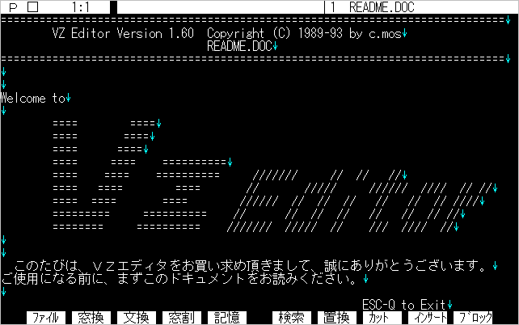
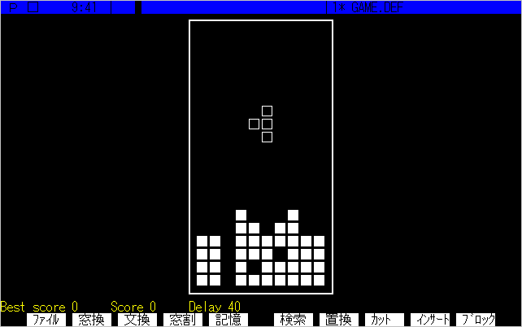
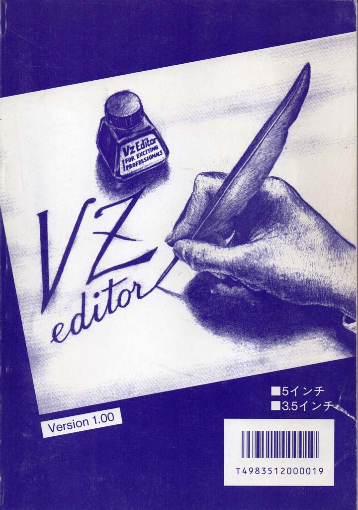
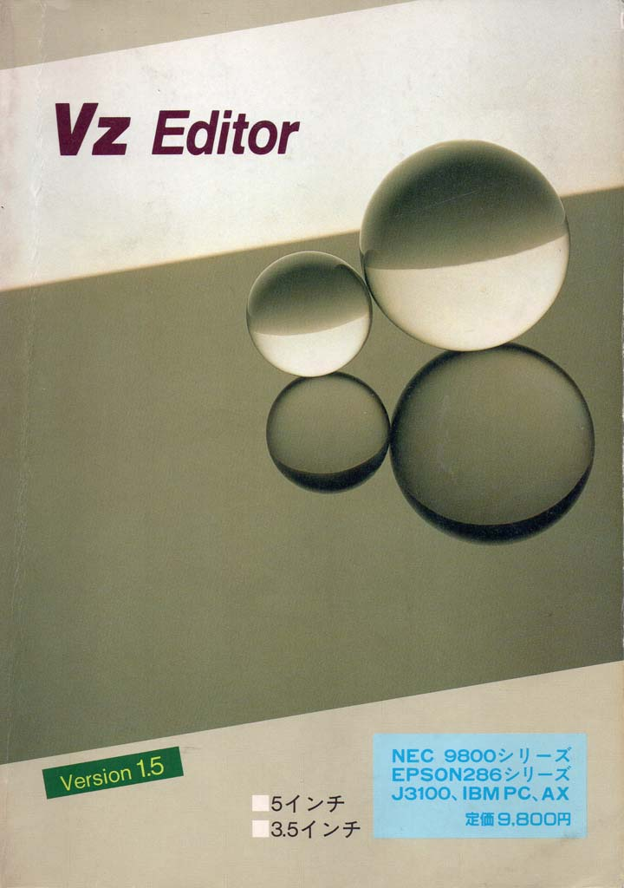
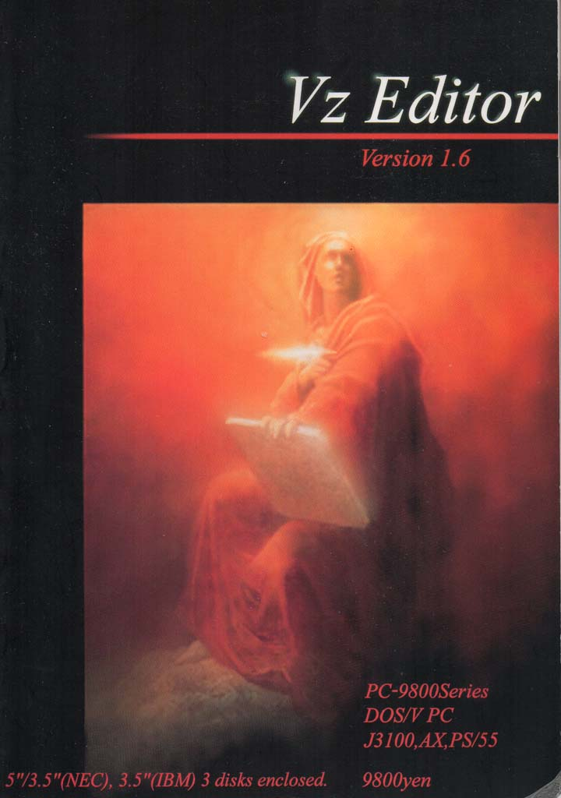

# VZ Editor

この度、VZ Editor Ver1.6を、オープンソース・ソフトウェアとして公開する運びとなりました。快諾して頂けた中村満氏に感謝いたします。古き良き(?)MS-DOSの時代に思いを馳せて頂ければ幸いです。

[長い［謝辞］ 中村満](./from_vc.md)

## コンテンツ

- **VZ-PC98** 
PC-9800、J-3100版のマスターディスクです。
- **VZ-IBM** 
DOS/V、AX、PS/55、US版のマスターディスクです。
- **SRC** 
ソースファイルです。 
※ 公開の時点では、ビルドする(フリーの)アセンブラ・リンカを見つけられていません。
- **Manual** 
マニュアルをMarkDown文書化したものです。 
※ 10.6「30行BIOS」と、巻末の「INDEX」は含まれません。
- **FDImage** 
エミュレータ用のFDイメージ(ベタ形式)です。
- **VZ157** 
Ver1.57です。最終的にはVer1.59Hまでアップデートされたようです。
- **Magazine** 
**PC Power**誌に連載された「楽しいプログラミング」です。(全7回)

## エミュレータ

- 画面キャプチャ等、PC-9801のエミュレータは、[Neko Project II x64](https://www.yui.ne.jp/np2/)を使用させて頂きました。
- DOS/V版のエミュレータは、[DOSVAXJ3](https://www.nanshiki.co.jp/software/dosvaxj3.html)が、PC-DOSを用意する必要が無く簡単です。

## マクロ

VZ Editorは、ユーザの皆様によって本当に沢山のマクロが作成されましたが、作者と連絡を取れない関係でここには掲載できないのが残念です。
**VZ倶楽部**に収録されたマクロは手元にありますので、後日掲載できるように、**Macors**フォルダを用意しました。

### ドラゴン・シーク２

https://github.com/user-attachments/assets/10da2571-1104-4342-a9ef-43c8dd2654c3

なんと、VZマクロでドラクエ風RPGを作っちゃった人がいました！Ver1.6は互換性の問題で動かないようなので、Ver1.5Xが必要です。作者の斉木浩三様、もしここを読まれましたら、c_mos@twitter までご連絡ください。ぜひ掲載したいので。

## マニュアルカバー

Ver1.0と1.6は、磯崎健一氏の作画。Ver1.5は素材の候補から選びました。寄り添っている親子のようでお気に入りです。

### Ver1.0/1.5

 

### Ver1.6

 

